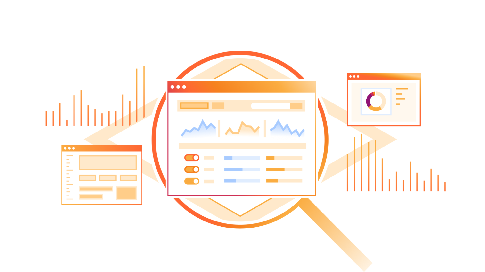
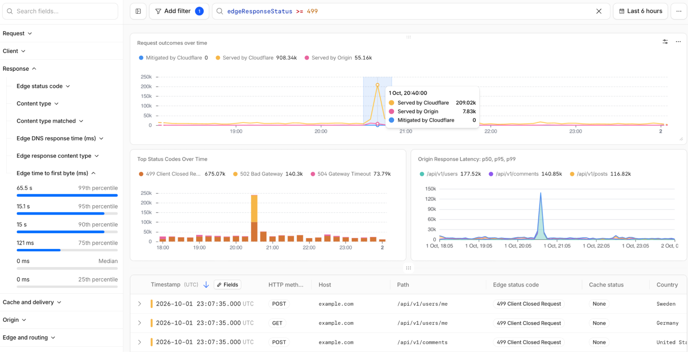
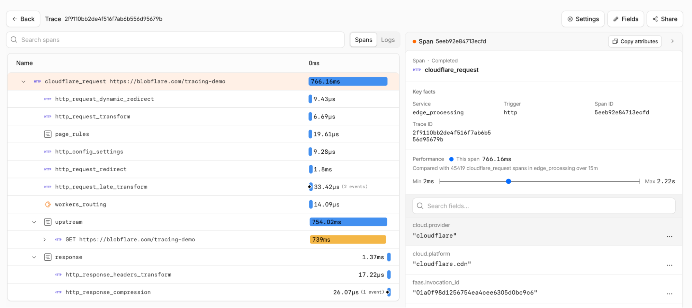
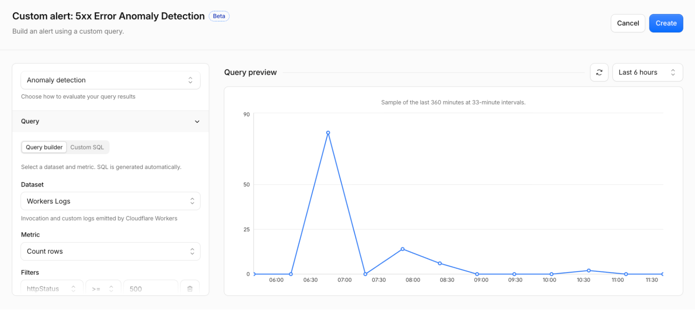
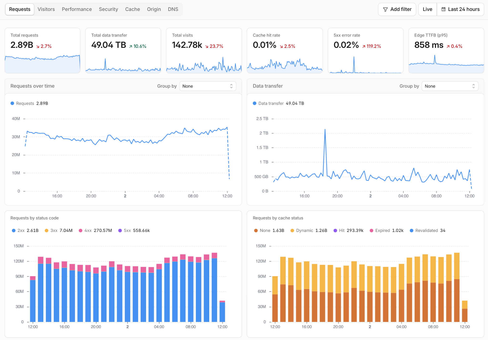
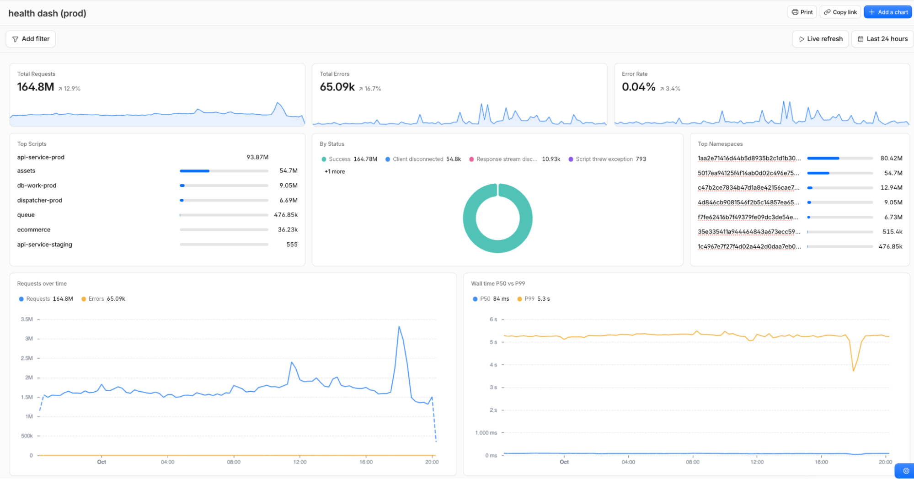

# 8 major updates to Cloudflare Observability
By Nevi Shah, Arti Kumar, Tom Benn, and Sahidya Devadoss · Cloudflare Blog · October 2, 2026

Today, we’re launching eight major updates that bring your logs, traces, analytics, alerts, dashboards, and exporting into [one observability platform](https://developers.cloudflare.com/observability/), with simpler and more predictable pricing.

**Here's what's launching:**

- [One place to explore logs from across Cloudflare](https://blog.cloudflare.com/one-observability-platform/#1-investigate-all-your-logs-in-one-place)
- [End-to-end tracing from Cloudflare's edge to your origin](https://blog.cloudflare.com/one-observability-platform/#2-trace-requests-through-our-entire-platform-now-in-open-beta)
- [One unified SQL API for querying Cloudflare data](https://blog.cloudflare.com/one-observability-platform/#3-have-your-agent-query-observability-data-with-one-unified-sql-api)
- [One pricing model for observability data ingested and stored across Cloudflare](https://blog.cloudflare.com/one-observability-platform/#4-new-pricing-for-all-ingested-and-stored-logs-and-traces)
- [Custom alerts on your observability data](https://blog.cloudflare.com/one-observability-platform/#5-configure-custom-alerts-on-your-observability-data-now-in-beta)
- [All analytics for your domain in one place, with 30 days of data retention](https://blog.cloudflare.com/one-observability-platform/#6-see-your-domain-analytics-in-one-place-now-with-30-days-retention)
- [Custom dashboards built from your observability data](https://blog.cloudflare.com/one-observability-platform/#7-build-custom-dashboards)
- [Export your data with Logpush -- now available on self-serve plans](https://blog.cloudflare.com/one-observability-platform/#8-logpush-is-now-available-on-all-self-serve-plans)

## One observability platform for all of Cloudflare

Understanding an issue often requires data from more than one Cloudflare product. A spike in 5xx responses could come from a Worker, from your origin, or from Cloudflare failing to connect to your origin globally or regionally. But investigating it today requires knowing which product owns each signal and how to query it.

Observability should be a platform-wide capability: it should reflect how applications actually behave and give you the complete context needed to resolve an issue. Over the coming months, you’ll see more Cloudflare products, datasets, and workflows become part of this shared observability platform, with more consistent pricing, product experiences, and features. These eight updates are the first step into a more unified Observability problem.

## 1. Investigate all your logs in one place

The [new Logs home](https://developers.cloudflare.com/observability/logs/) combines [Workers Observability](https://developers.cloudflare.com/workers/observability/) (for debugging Workers applications and its connected resources) with [Log Explorer](https://developers.cloudflare.com/log-explorer/) (for searching across security logs). You can now choose from log datasets like HTTP events, firewall events, Workers, Containers, R2, and AI Gateway, and use the same investigative tools and capabilities for each.

Start with an increase in request latency, group it by hostname or data center, narrow the results to affected paths, and inspect individual requests by Ray ID. If the investigation leads to another Cloudflare product, switch datasets without leaving Logs. Support for querying across multiple datasets is coming soon, making it possible to connect related events across products in a single query.

You can query your logs with raw SQL or with built-in filters to narrow down on specific events. Create visualizations with natural language, and easily investigate and understand detected anomalies.

## 2. Trace requests through our **entire** platform — now in open beta

We’re launching [Cloudflare Traces in open beta](http://blog.cloudflare.com/cloudflare-tracing), giving you a request-level view of supported security rules, transformations, cache decisions, routing, Workers, and origin handling. You get to see how your traffic moved through our platform, and connect the dots between how you’ve configured Cloudflare, and how this influences request processing time, routing decisions, and more.

[Set a baseline sampling rate](https://developers.cloudflare.com/observability/traces/configuration/) for continuous visibility, then use [Trace Rules](https://developers.cloudflare.com/observability/traces/configuration/#trace-rules) to capture specific traffic at a higher rate during an investigation. Target hostnames, paths, IP addresses, or headers, search by [Ray ID](https://developers.cloudflare.com/fundamentals/reference/cloudflare-ray-id), and inspect the resulting spans directly in the Cloudflare dashboard.

You can export traces over [OpenTelemetry](https://opentelemetry.io/), while [W3C trace context propagation](https://www.w3.org/TR/trace-context/) lets you accept incoming trace context and pass along context to your origin. Check out the [full blog post to learn more about Cloudflare Tracing](http://blog.cloudflare.com/cloudflare-tracing) or give  this command to your agent to get started:

## 3. Have your agent query observability data with one unified SQL API

Agents also need a consistent way to sift through your observability data, investigate issues, correlate signals, and verify fixes. We’re launching [a unified SQL API,](https://developers.cloudflare.com/analytics/sql-api/) now in beta, for querying telemetry across Cloudflare. Instead of integrating separately with Workers logs, Containers security events, HTTP request logs, and analytics data, people and agents can query them using one SQL dialect, authentication model, and API.

Your agent can use the new [Cloudflare CLI](https://blog.cloudflare.com/cloudflare-cf-cli-launch/), `cf`, to find and run queries from the command line or connect through [Cloudflare’s Observability MCP](https://github.com/cloudflare/mcp) server to investigate logs, traces and analytics. [Dataset schemas, fields, and example queries](https://developers.cloudflare.com/analytics/sql-api/datasets/) are available to help both people and agents build queries.

Additionally, we’re also bringing the SQL interface directly into Workers with a [native binding.](https://developers.cloudflare.com/workers/runtime-apis/bindings/analytics-sql/) Your Worker can now do things like query [Analytics Engine](https://developers.cloudflare.com/analytics/analytics-engine/) data to meter customer usage and power billing workflows, build customer-facing analytics dashboards, generate health reports, or automate incident investigation without configuring a separate API client.

## 4. New pricing for all ingested and stored logs and traces

For all logs and traces ingested and stored on Cloudflare, we are moving to one unified Observability subscription and pricing. Beginning **December 1, 2026**, this pricing model will apply across all plans (effective upon renewal for all Enterprise customers) and cover existing Developer Platform logs, including Workers, Containers, AI Gateway, as well as all tracing data.

Because logs and traces can vary dramatically in size, the new model is based on the **volume you ingest and store** rather than an event-based count. This pricing adjustment will be. Check out our [documentation](https://developers.cloudflare.com/observability/pricing/) for more details on pricing.

| Plan | Included Usage | Retention | Additional usage |
| --- | --- | --- | --- |
| Free | 0.5 GB of ingestion per day | 7 days | Not available |
| Paid and Enterprise | 50 GB of ingestion  10 GB-month of storage per billing cycle | Up to 1 year  (coming soon) | $0.25 per GB ingested $0.10 per GB-month stored |

## 5. Configure custom alerts on your observability data – now in beta

Notifications ([now called “Alerts”](https://developers.cloudflare.com/notifications/)) just got a major upgrade. You can now define custom alerts directly on anything supported by our new unified SQL API, including HTTP request logs, Workers events, Workers Analytics Engine datasets, analytics datasets, traces, and security events.

Choose a dataset in the dashboard or define the condition using custom SQL. Then select a threshold, anomaly, or SLO, set the evaluation window, and choose where the alert should go. You might alert when origin 5xx responses exceed a threshold for five minutes, a Container repeatedly fails, Worker errors increase after a deployment, or trace latency crosses an expected limit.

You can send alerts right to tools your teams are already using, including incident management tools, chat platforms, and webhooks. [Webhooks are now available on all plans](https://developers.cloudflare.com/notifications/get-started/configure-webhooks/), allowing you to route alerts to custom services or even your agent to begin investigating immediately. To get started check out our [documentation](https://developers.cloudflare.com/notifications/) or give this command to your agent:

## 6. See your domain analytics in one place — now with 30 days retention

Understanding what is happening on your domain has often meant piecing together metrics from different Cloudflare products. We’re bringing traffic, performance, security, cache, origin, and DNS data together so you can see how they relate. If latency increases, you can quickly see whether it is tied to a specific Cloudflare data center, hostname, or origin.

In addition, you now get [30 days of domain analytics on every plan.](https://developers.cloudflare.com/analytics/account-and-zone-analytics/zone-analytics/) A full month of history gives you time to investigate issues after they happen, compare today with the same day in previous weeks, and tell the difference between a one-time spike and a longer trend.

## 7. Build custom dashboards

Prebuilt dashboards cover common use cases, but applications often use several parts of Cloudflare. With [Custom Dashboards](https://developers.cloudflare.com/analytics/custom-dashboards/), you can bring together analytics from across Cloudflare, logs and traces from the Workers platform, and security events in one view. Track request volume, errors, latency, storage, and blocked traffic, then share the dashboard with your team. Instead of rebuilding queries during every investigation, you have one place to monitor the signals that matter to your application.

## 8. Logpush is now available on all self-serve plans

[Logpush](https://developers.cloudflare.com/logs/logpush/), previously available only to Enterprise, is now available on all self-serve plans, letting you export all Cloudflare logs to the tools and destinations you already use. Need to apply filters, perform redaction, enrich events or reshape output before delivery? [Transformers](https://developers.cloudflare.com/logs/logpush/transformers/) is now generally available, letting you apply any SQL transformation without operating a separate ETL pipeline.

We’re introducing [usage-based pricing](https://developers.cloudflare.com/changelog/post/2026-09-30-logpush-usage-based-pricing/) for Logpush and Transformers. Each includes a free monthly allowance, with simple pricing for additional usage:

| Export usage | Included each month | Additional usage |
| --- | --- | --- |
| Exports to Cloudflare destinations | 25 GB | $0.03 per GB |
| Exports to external destinations | 25 GB | $0.10 per GB |
| Logpush Transformers | 1 GB | $0.04 per GB |

Visit the [documentation](https://developers.cloudflare.com/logs/logpush/) to get started with Logpush and explore complete pricing details.

## What's coming up:

- **Longer retention for your observability data:** You’ll be able to retain logging and tracing data for up to one year, making it easier to investigate recurring issues, compare historical behavior, and analyze long-term trends.
- **OpenTelemetry API support in Workers:** We’ll continue building out our OpenTelemetry APIs to enable adding attributes to existing spans or getting trace context.
- **Easier metrics export with OpenTelemetry:** You’ll be able to send Cloudflare metrics to OpenTelemetry-compatible destinations and analyze them alongside telemetry from the rest of your stack.
- **New pricing takes effect December 1, 2026:** If you ingest or store observability data on Cloudflare, the unified pricing plan will apply to your usage. We’ll notify you before the change takes effect.

## Ready to start investigating?

We hear you when you say Cloudflare can feel like a black box. These updates are just the beginning of exposing what’s happening, making the underlying data accessible, and giving you the context that you need to act. That transparency matters even more as agents move from writing software to operating it. An agent can only close the loop between a change and its outcome if it can query what happened, identify the failure, and verify the fix.

By building around [OpenTelemetry](https://opentelemetry.io/), [W3C Trace Context,](https://www.w3.org/TR/trace-context/) and SQL, we are committed to giving you and your agents standard, portable interfaces to that context. Check out our new [Observability documentation](https://developers.cloudflare.com/observability/) home to learn more.
