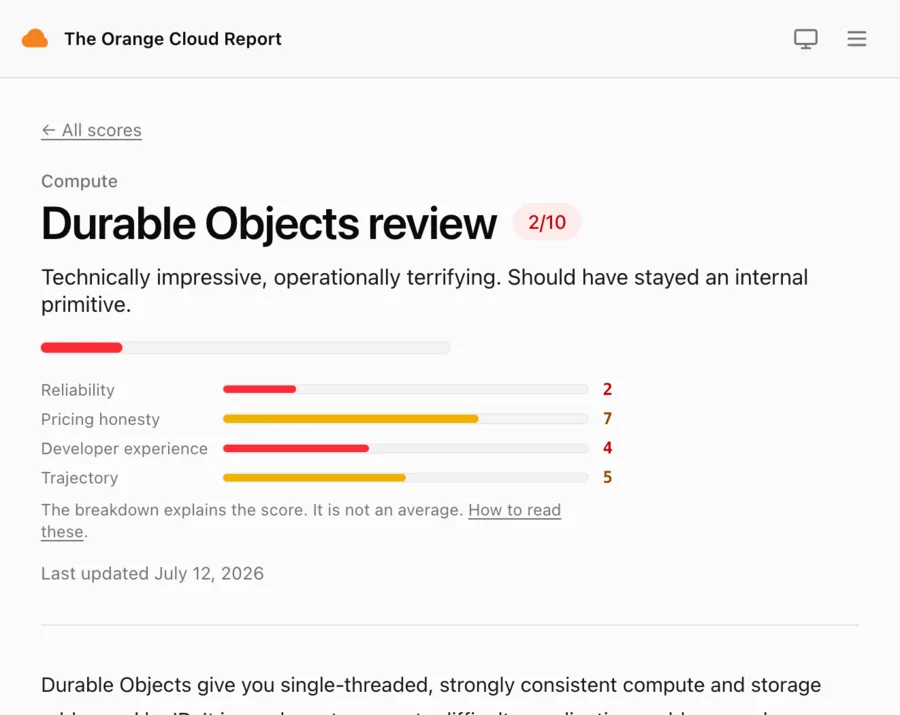
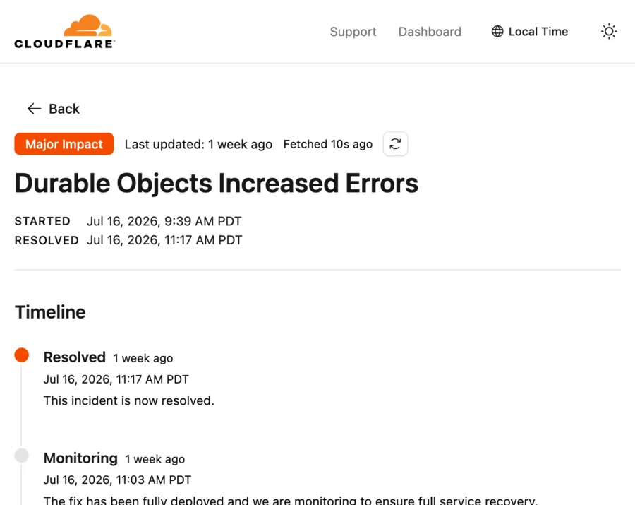

# celld

## self-hosted, distributed **Durable Objects**

- Your Workers and Durable Objects code runs unchanged [(supported APIs →)](https://celld.dev/docs/cloudflare-compat)
- Your data lives in a bucket you own
- Orders of magnitude cheaper at scale

## Key characteristics

### Durability

| | | |
|---|---|---|
| Writers per cell (epoch-fenced) | 1 | |
| Acknowledged writes lost on kill | 0 | RPO=0 |
| Durable write latency (region-local) | ~90 | ms |
| Failover after node loss, 0 lost | ~20 | s |

### Speed (warm)

| | | |
|---|---|---|
| Stateless request p50 / p99 | 0.2 / 0.3 | ms |
| Stateless throughput / worker thread | ~94k | req/s |
| Wake a hibernated cell | ~4 | ms |

### Density & cost

| | | |
|---|---|---|
| RAM per resident cell | 0.47 | MB |
| Resident cells / 8 GB node | 2,500 | cells |
| Inactive cell cost | ~0 | bucket ops |
| $ / resident cell-month | ~$0.02 | |

### Compatibility

| | |
|---|---|
| Supported Workers/DO APIs | [docs →](https://celld.dev/docs/cloudflare-compat) |

1. Speed and density: one node, trivial cells, an Apple M-series laptop over loopback. Fleet vCPUs are slower — activation p50 is 35.9 ms on a 2 vCPU node.
2. Durability: a 4 vCPU / 8 GB fleet in one region, against a region-local bucket. Failover is SIGKILL of a loaded node with every room verified after recovery. [How this is measured →](https://celld.dev/docs/testing)

### Monthly cost vs resident fleet size

1. Durable Objects: Workers Paid, $5/mo plus $4.15 per resident cell-month; its free plan covers toy scale.
2. celld: whole $48 / 8 GB nodes (DigitalOcean us-east list), capped at 2,500 resident cells each; capacity is added in steps.
3. Base cost before workload: application traffic and writes add compute and bucket usage. Click a dot for the modeled bill.

## How it works

The bucket is the coordinator — no membership protocol, no failure detector, no consensus. Ownership is a record in your bucket, claimed with one atomic write. celld's built-in replicator continuously ships each cell's SQLite state to that bucket as LTX segments.

## Reliability

Durable Objects is a strong programming model. celld keeps that model while moving placement, state, and operational evidence into infrastructure you choose.

[orangecloud.report · 12 July 2026 ↗](https://orangecloud.report/products/durable-objects/)

[cloudflarestatus.com · 16 July 2026 ↗](https://new.cloudflarestatus.com/incidents/kdnfshk5vs51)

**What changes when you run the model yourself.**

PLACEMENT

#### No shared machine to lose

A cell's identity isn't fused to a machine — ownership is a lease in your bucket, granted by compare-and-swap. Lose a node and another acquires the lease and restores the cell in seconds: your fleet reading your storage, not a vendor restoring a placement you can't see.

BLAST RADIUS

#### A failure domain you choose

Your fleet still depends on its machines, network, and bucket provider. What changes is tenancy: no shared Durable Objects scheduler or placement layer can couple your application to another customer's workload.

LEGIBILITY

#### A failure you can read

When a cell misbehaves the evidence is on your disk — the ownership record, the SQLite and LTX files, and the logs. You answer "what happened to my cell" with sqlite3 and grep, not a status page that declines to say.

Self-hosting is not automatically more reliable. It makes the failure domain explicit and inspectable: your nodes, your bucket provider, and your operational choices.

**And to be clear about the tone:** we love Cloudflare — this very page is served by a Cloudflare Worker. The Durable Objects model — a single-threaded object with its own storage, addressed by name — is one of the best primitives distributed systems has been handed in years, and that design is **Kenton Varda**'s and the **Cloudflare Workers** team's. celld is a love letter to their idea; a primitive this good deserves to run anywhere.

**celld** = [V8](https://v8.dev) + [SQLite](https://www.sqlite.org) + [LTX](https://github.com/superfly/ltx)

a stateful distributed system that rests entirely on S3

LTX is Litestream's replica format, from [Ben Johnson](https://github.com/benbjohnson/litestream)
