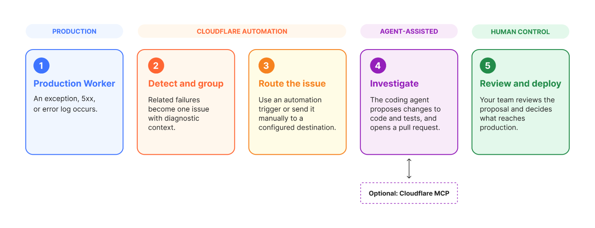
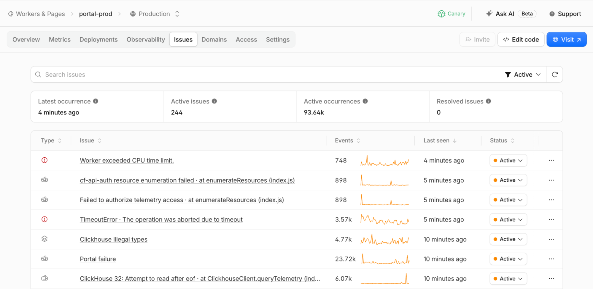
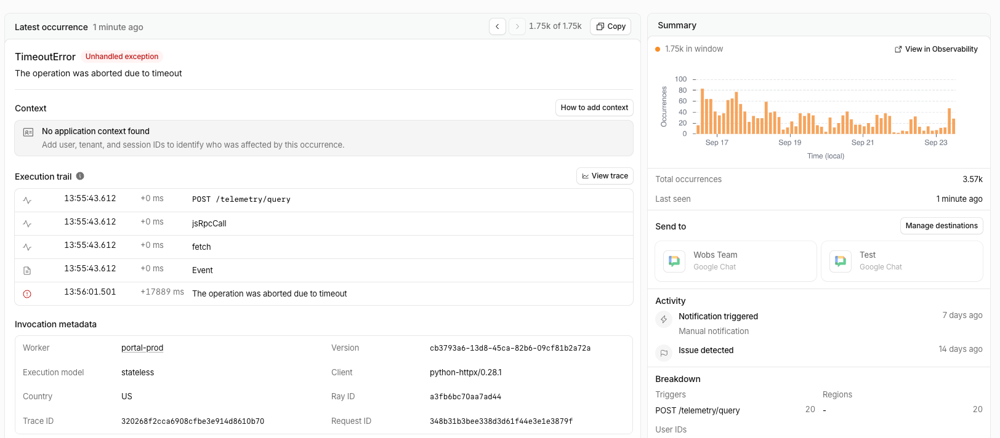
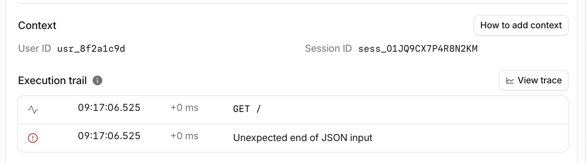
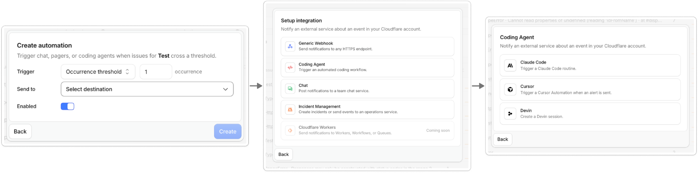

# Detect and send production issues straight to your agent
By Thomas Ankcorn, Maksym Makuch, and Nevi Shah · September 30, 2026

As agents help us build more complex applications, both humans and agents need a better way to stay on top of what goes wrong in production. Coding agents can already query observability data, navigate a repository, change code, write tests, and open a pull request. What remains manual is connecting those steps: recognizing that repeated failures come from the same bug, gathering the relevant logs and traces, sending that context to an agent, and checking whether the fix worked. Without that structured handoff, the agent must search raw telemetry to reconstruct the scope and context of the failure before it can investigate.

Today, we are introducing **Issues**, [built-in error monitoring for Cloudflare Workers ](http://developers.cloudflare.com/workers/observability/issues/)(now in open beta!) to streamline this workflow. Issues can:

- Group repeated exceptions, 5xx responses, and error logs into one issue.
- Send the error, stack trace, logs, traces, and Worker version to a configured coding agent.
- Trigger the agent’s configured workflow — from triaging an issue to querying more data to opening a pull request.



Fix your first issue with the following prompt for your agent with [CF CLI](https://blog.cloudflare.com/cloudflare-cf-cli-launch/) or checkout the [documentation](https://developers.cloudflare.com/workers/observability/issues/#enable-issues) to get started:

## Catch failures automatically

[With one line of configuration](http://developers.cloudflare.com/workers/observability/issues/#enable-issues), you can start receiving Issues detected on your Worker with no additional instrumentation required. Issues are built into the Workers runtime, so there is no SDK to install or application wrapper to add.

Once enabled, Issues records uncaught exceptions, failed invocations, HTTP `5xx` responses, output from `console.log()` and `console.error()`, and logs that contain a stack trace. It also flags runaway alarm conditions and code that writes large volumes of logs inside loops.

Consider a Worker whose handler starts throwing errors after a deployment. Every failed request has a different request ID, but they all come from the same bug. Issues groups them together and shows when the error first appeared, how many times it has happened, and whether it is becoming more frequent.



When you open an issue you can see the error, a stack trace when available, the logs and traces leading up to it, the Worker version, request details and trend of the issue over time, as shown below:



## Contextualizing errors for your agent

Cloudflare can capture what happened inside the Worker, but it does not know which users, accounts, or sessions matter to your application. Use the [Worker runtime's](https://github.com/cloudflare/workerd) built-in [OpenTelemetry API](https://opentelemetry.io/) to [add those identifiers](https://developers.cloudflare.com/workers/observability/traces/custom-spans/), without installing another package:

```
import { tracing } from "cloudflare:workers";

export default {
  async fetch(request: Request): Promise<Response> {
    const { userId, accountId, sessionId } = await getAuthDetails(request);
    const span = tracing.getActiveSpan();

    span?.setAttribute("user.id", userId);
    span?.setAttribute("account.id", accountId);
    span?.setAttribute("session.id", sessionId);

    return handleRequest(request);
  },
} satisfies ExportedHandler;
```

Those identifiers appear with each occurrence. In this issue, you can now see whether failures are concentrated in one account or session before sending the issue to an agent.



## Send detected issues to your agent

An issue no longer has to sit in a dashboard while someone copies a stack trace and pastes it into a prompt. Configure an automation once, and when an issue crosses an occurrence threshold or returns after a quiet period, Issues sends it straight to your agent through [**Automations**](http://developers.cloudflare.com/workers/observability/issues/automations/). You can choose when the automation should run and where the issue should go.

This can be via:

- **Built-in coding agents:** Connect [Claude Code](https://code.claude.com/docs/en/routines#add-an-api-trigger) with a routine ID and token, [Cursor](https://cursor.com/docs/cloud-agent/automations#webhook-triggers) with an automation webhook URL, or [Devin](https://docs.devin.ai/api-reference/authentication) with an API token and organization ID.
- **Generic webhooks**: Send issue context to your own agent or HTTPS endpoint.
- **Chat and incident management:** Notify your team through chat or an on-call workflow.



When the automation runs, Issues sends the failure summary and diagnostic context captured with the issue — the exception, error, source-mapped stack trace, leading and trailing logs and traces, Worker version, and the application context you added. For deeper investigation, you can connect the agent separately to [Cloudflare MCP](https://github.com/cloudflare/mcp-server-cloudflare/tree/main/apps/workers-observability) that lets the agent query the related logs and traces so that it can propose code and test changes and open a pull request.

You stay in control of what reaches production: review the pull request, deploy the fix, and mark the issue resolved.

## How Issues uncovered and resolved two Workflows bugs in one day

[Cloudflare Workflows](https://developers.cloudflare.com/workflows/), a primitive that powers long-running, multi-step applications, is built entirely on the Workers platform.

Behind the scenes, its services keep track of steps, retries, and saved state. This makes Workflows a useful place to test Issues on our own production systems. Within a day of turning it on, the team found two unusual problems hidden inside a large volume of traffic.

- **A migration stuck in a retry loop:** A Workflows control plane migration repeatedly hit a SQLite foreign key error when attempting to apply migrations in an edge case. Issues allowed the Workflows team to identify the problem and fix it.
- **A deletion process that never completed:** Workflows discovered that during deletion of Workflow instances, there was an edge case where they could exceed a Workers subrequest limit and not finish the deletion. Issues helped the Workflows team identify the issue and do a fix.

Instead of leaving the team to connect thousands of separate pieces of telemetry and user reports, their automation setup sent these issues directly to [Cloudflare OS](https://blog.cloudflare.com/cloudflare-os/), which followed the errors into the Workflows code and proposed a fix for both issues.

## Get started

Ready to see what Issues finds in your app? To get started:

1. Set `observability.issues.enabled` to `true` in your `wrangler.jsonc` file
2. Set up your first automation [in the Cloudflare dashboard](https://dash.cloudflare.com/?to=/:account/workers/services/view/:worker/production/issues?status=active) to send issues to your destination of choice whether that’s an agent, a webhook, incident management tool or chat platform.

If your agent is handling setup, it can also use the new [cf CLI](https://blog.cloudflare.com/cloudflare-cf-cli-launch/) to inspect issues and create automations. Check out our [documentation](http://developers.cloudflare.com/workers/observability/issues/automations/) to learn more!
