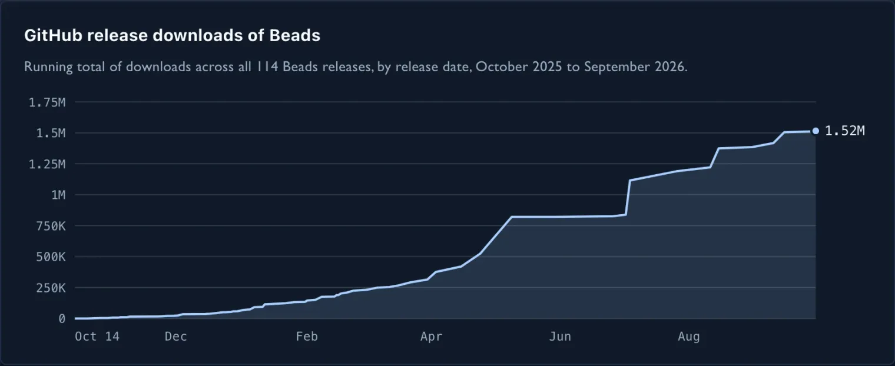
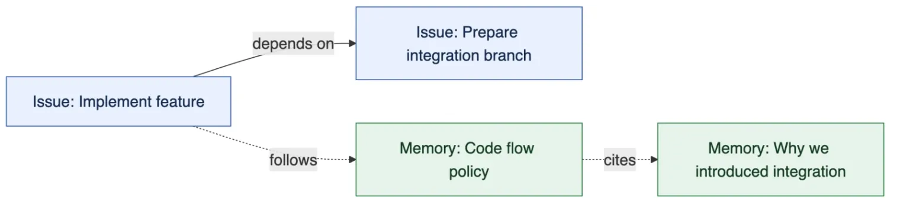
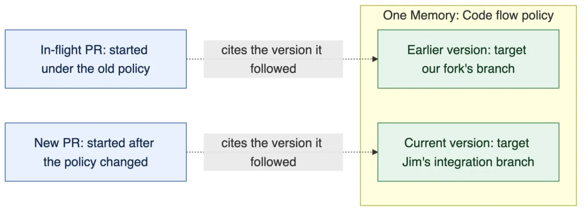

# Extending Beads: Memories, Versions and the Wire Protocol
By Donna Box · The City Wire · October 1, 2026


*This post reflects the work of [Stephanie Jarmak](https://github.com/sjarmak), [Jim Wordelman](https://github.com/quad341), [Chris Sells](https://github.com/csells), and [Donna Box](https://github.com/donnabox).*

## Beads, Issues, and Dependencies, oh my!

Beads has been a wildly successful way to keep agents on task. But Issues aren’t the only things we need them to remember.

Steve [introduced Beads in October 2025](https://steve-yegge.medium.com/introducing-beads-a-coding-agent-memory-system-637d7d92514a), after running into the limits of asking agents to keep track of a large development effort. Less than a year later, the [repository](https://github.com/gastownhall/beads) has more than 27,000 stars, 1,800 forks, and [over 1.5 million downloads](https://github.com/gastownhall/beads/releases) (as of October 1, 2026). Pretty good for an issue tracker.



Figure 1: Running total of GitHub release downloads across every Beads release, pulled October 1, 2026; downloads are not unique users.

What’s interesting is how naturally beads fit into an agent’s work. An agent can record something it discovered, connect it to work already in progress, and ask what’s ready to do next. When that agent runs out of context, the work is still there. The community that creates and maintains Beads has given us a useful foundation, and they’ve done it without requiring every coding agent to grow its own project management system.

Beads was built to track work for both agents and humans. As users stretch it further, more scenarios don’t fit neatly into the way beads organizes information. Today beads models information as *Issues*, and the relationships between them as *Dependencies*.

An Issue comes with specific expectations. Someone can claim it. It can be blocked. Eventually, someone may close it. These are useful semantics when the thing you’re modeling is work.

Consider a project’s code flow policy: where to branch from, which branch a PR should target, and what checks must pass before merging. An agent needs that guidance while doing the work. Putting it in an Issue makes it available in the system the agent already uses to track that work.

But what does it mean to close that Issue? Have we finished writing the policy, stopped following it, or just made it harder to find? And if an implementation Issue depends on the policy, is the work blocked until someone closes it? The policy needs to remain available and evolve as the project changes. Treating it as another Issue leaves every caller to remember which Issues aren’t really Issues.

Updating the code flow policy is work we can finish. We want an Issue for the change and a Memory for the knowledge it leaves behind, with a Link connecting them.

We’re extending Beads so Issues and Memories can live in the same graph. Since Beads has become pervasive enough to be part of the training sets for modern LLMs, we’re planning to leverage that training to take on more than just Issues by capturing long-lived knowledge as Memory Beads.

## Beads and Memory

A memory is information we want available beyond the current conversation: a project policy, a decision and its reasoning, or something an agent learned while doing the work. Humans and agents can both contribute it.

An agent figures out why a particular approach won’t work, you agree on an alternative, and then the session ends. A few days later, another agent proposes the same approach. You get to have the conversation again. Sometimes with the same agent.


Figure 2: The conversation ends, but what the agent learned goes somewhere it can be found again.

That knowledge needs to survive the conversation and the work, and it needs to be findable from the work it explains.

Beads already has a small memory system. `bd remember` stores text under a key, `bd recall` reads it, and `bd memories` lists or searches what we’ve saved. `bd prime` can put those memories into an agent’s starting context. This is useful, especially for a handful of project reminders.

But a keyed string only gets us so far. The memory commands don’t give each entry a canonical Bead identity, explicit Links, or addressable versions with change attribution. If I change the target branch in our code flow policy, an in-flight PR can’t cite the exact policy state it followed through those commands. And loading all the bodies at startup spends context before the agent knows which ones matter. These are the gaps [Chris’ Memory Beads proposal](https://github.com/gastownhall/beads/issues/5877) is trying to close.

The proposed Memory Bead has an identity, a title, and a Markdown body. An Issue can link to it. It can link to other memories. A caller can discover a few promising memories and then explicitly read the ones it needs. Changes participate in shared Beads History, so a caller can inspect an earlier state and see the attribution recorded with it.

Unlike an Issue, a Memory doesn’t become ready or blocked, and we don’t close it when we’ve finished reading it. We can correct it or retire it. That seems like a much better fit for project knowledge.

## Generalizing the data model

We could build a memory store beside the Issue store and add some special machinery to connect them. Then we’d have two answers to questions like how to identify a record, read its properties, or follow a relationship. Every tool that wanted to work with both would get to learn both.

Instead, we’re making the common model explicit and defining Memory in terms of it. Issues participate in that model too. The test for this generalization is concrete: can an implementation Issue depend on a prerequisite Issue, cite a code flow policy Memory, and let us follow that policy’s Links to the reasoning behind it, while the existing Issue workflow continues to make sense? That’s the first graph people should be able to use.

A Bead is an identified, typed thing with properties. A Link is an identified, typed, directed relationship with properties of its own. Together, they form a graph; Beads are nodes, Links are edges. An Issue and a Memory are different kinds of Bead; a blocking Dependency is a kind of Link between Issue-typed Beads.



Figure 3: Work and knowledge in the same graph. The solid edge is a blocking Dependency; dashed edges are informational Links. Relationship labels describe their purpose.

Giving Links their own identity matters. We can read a particular Link, change its properties, or remove it without guessing which relationship between two Beads the caller intended.

The meaning of a Bead or Link still comes from the Type. Closing a prerequisite can make an implementation Issue ready. Editing a policy Memory doesn’t. An informational Link to that policy doesn’t block just because one endpoint is an Issue. The [generic graph CLI proposal](https://github.com/gastownhall/beads/issues/6703) describes how the familiar commands could work over this model.

We also need room for application-specific data. The Beads proposal calls that extension point `metadata`: an open record on both Beads and Links. A tool can record a confidence value or a validity window without coining a Type for every variation.

## Beads Protocol

A graph of Beads and Links can live in one project. But the code flow policy might belong to the team, while the Issue following it belongs to one of the team’s repositories. Copying the policy into every project creates another problem: which copy did we use, and which copies need to change when the team corrects it?

This is where the Beads Protocol, or [BDP](https://github.com/gastownhall/bdp), comes in. It defines the shared data model and an HTTP interface for working with it. A viewer, an agent, or a tool assembling context for one should be able to read a Bead, inspect its Type, and follow its Links without knowing the database schema behind the server. In Beads, the CLI and the BDP HTTP front end use the same underlying engine and storage.

Types make these distinctions something tools can understand. In BDP, a Bead or Link has one declared Type, identified by a URL. Its Type descriptor can supply a JSON Schema for its properties and, for a Link, constraints on its endpoints.

BDP calls the owning boundary a *Scope*. A Scope has a canonical base URL, and each Bead and Link belongs to exactly one Scope. For example, within `https://beads.example/team/`, the local identity `beads/code-flow-policy` resolves to `https://beads.example/team/beads/code-flow-policy`.

A Link can cross a Scope boundary. The project can keep a Link from its implementation Issue to the team’s code flow policy without importing the team’s entire database. An endpoint outside the Link’s Scope is carried as a Reference, which is the URL to the Bead in another Scope. The URL tells us where to find the Bead; access still requires permission.


Figure 4: Separate Beads stores, each its own Scope, with Links reaching across from a Bead in one to a Bead in another.

There are limits to what this buys us. A local write can’t guarantee that another Scope will remain online or retain a policy forever, and it doesn’t become a transaction across both stores. Cross-Scope Links let us record the relationship without pretending we own the other end.

## Versioning

The proposed model makes earlier states addressable so a citation can keep its meaning as the graph changes.

Let’s say we introduce a new integration branch. We update the code flow policy so agents know where to base new work and send new PRs. But branches and PRs are already in flight under the previous policy. Reading only today’s instructions can make those earlier choices look wrong.

That gives us two ways to refer to a Bead: follow its current state using just its URL, or pin a Reference to one exact retained version. An agent starting a new branch needs the current policy; an in-flight PR should be able to cite the version it followed.



Figure 5: The proposed versioned-reference model keeps both citations meaningful as the policy changes. These are two versions of one Memory, not two separate policies; the PR boxes represent work referring to that Memory.

Relationships need to participate too. If a Memory cites a different source after an edit, its text might be unchanged while its meaning has changed substantially. In BDP, a Type can declare ownership of outgoing Link Types. Changing one of those owned Links changes the source Bead’s version. Merely pointing at another Bead doesn’t version the target.

There is also the more immediate problem of two agents editing the same record. Each should be able to say which revision it started from. If another write has landed, a guarded write fails so the caller can read the new state and decide what to do. The Memory proposal also allows unguarded writes, but requires the result to identify the version replaced and its attribution. Keeping history doesn’t excuse a silent overwrite.

Retained history needs a clear contract: an old address must continue to mean the same state, and a store that can no longer serve that state must say so, never substitute the current version. BDP’s historical resolution capability makes that promise explicit. The [BDP specification](https://github.com/gastownhall/bdp/blob/main/docs/specs/bdp.md) describes the detailed rules for identities, Types and conditional operations.

## Try it out and let us know what you think!

If you’d like to try this as we build it, you can! Our [integration branch](https://github.com/versioned-beads/beads/tree/integration) has the preview ready to explore. Some of the model described above is still being implemented, and this work hasn’t landed in upstream Beads yet. The [graph CLI guide](https://github.com/versioned-beads/beads/blob/integration/docs/reference/graph-cli.md) walks through the commands; the [technical reference](https://github.com/versioned-beads/beads/blob/integration/docs/reference/graph-preview.md) records their bounds and unsupported operations. Both can evolve after this post is published.

> **Danger!** The preview branch is for new projects only, not your existing ones. It may corrupt your Beads data. Make sure you have backups, quarantines, and mosquito netting in place before you start.

Use `bd` built from the integration branch, rather than a released Beads binary. From a fresh parent directory, build with Go 1.26.7 or the toolchain selected by the repo:

```sh
git clone --branch integration https://github.com/versioned-beads/beads.git
cd beads
CGO_ENABLED=1 go build -tags gms_pure_go -o ./bd ./cmd/bd
export PATH="$PWD:$PATH"
cd ..
```

In another terminal, start an ordinary Dolt SQL server using a new data directory; leave it running during the walkthrough:

```sh
mkdir -p memory-beads-dolt
dolt sql-server --host 127.0.0.1 --port 3306 --data-dir "$PWD/memory-beads-dolt"
```

Start the Beads example in a **new** directory with no existing `.beads` workspace; this preview does not migrate an existing Issue database or an older graph-preview schema. BDP serving currently requires shared-server mode. For an embedded-only CLI walkthrough, see the [graph CLI guide](https://github.com/versioned-beads/beads/blob/integration/docs/reference/graph-cli.md).

```sh
mkdir memory-beads-demo
cd memory-beads-demo
git init
bd init --graph-mode link --scope-url http://127.0.0.1:8765/demo/ \
  --server --external --server-host 127.0.0.1 --server-port 3306 \
  --server-user root --non-interactive

# Inspect the capabilities and limits of this build.
bd status --graph
bd types

# Record the current code flow policy and read it back.
bd remember "Base new work on our fork's integration branch and target PRs there. Merge only after CI passes." \
  --id beads/code-flow-policy --title "Code flow policy"
bd recall code-flow-policy

# Update the same Memory when the integration target changes.
bd remember "Base new work on Jim's integration branch and target PRs there. Merge only after CI passes." \
  --update code-flow-policy
bd versions code-flow-policy

# Track adopting the new policy as work, and link the policy to that Issue.
bd create "Move new work to Jim's integration branch" --id adopt-integration
bd link code-flow-policy adopt-integration \
  --link-type types/preview-related-v2
bd links code-flow-policy
bd list --format records-json --all

# Start the read-only BDP endpoint. Leave this running.
bd serve --readonly --addr 127.0.0.1:8765
```

A Memory owns its outgoing informational Links, so changing one also changes the Memory’s version. By default, these writes accept the current state; no guard flag is required. For an edit based on a previously read version, use `--if-source-revision TOKEN` on a Link write or `--if-revision TOKEN` on a Memory body update. A stale token rejects the change. Explicit `--unconditional-source` and `--unconditional` remain available to spell out the default.

`bd versions BEAD` lists versions newest first in graph mode; `bd history BEAD` is an alias there. Each row carries an opaque version token and a store-local ordering number. Use the **token** with `bd show BEAD --version TOKEN` or `bd compare BEAD --from TOKEN --to TOKEN`; the number is not a portable version address. `bd memories` searches current Memories, not their history. BDP HTTP History and restoration are still ahead.

In another terminal, read and enumerate the Beads through BDP HTTP:

```sh
curl --fail http://127.0.0.1:8765/demo/beads/code-flow-policy
curl --fail http://127.0.0.1:8765/demo/beads/adopt-integration
curl --fail 'http://127.0.0.1:8765/demo/beads/?limit=1'
```

The collection response includes `items` and a `next` URL. Follow that complete URL until `next` is null to enumerate the collection. The [Python example](https://github.com/versioned-beads/beads/tree/integration/examples/bdp-read) demonstrates BDP reads and pagination using the standard library. Scripts read through BDP HTTP; they do not need to invoke the CLI. The local listener uses HTTP, not HTTPS.

Graph initialization also installs guidance in `AGENTS.md`, including Stephanie Jarmak’s instructions for remembering useful knowledge, and registers the Claude Stop hook in a new workspace. An existing graph workspace can run `bd setup claude` to install the hook. Whether an agent chooses the right things to remember is something we’d like your help evaluating. Try it with your agent and tell us what it saves, what it retrieves, and what it misses.

The integration branch brings Memory creation and editing, mixed Issue/Memory Links, local version listing, and BDP HTTP reads together. HTTP writes and HTTP History are still ahead. The [graph CLI guide](https://github.com/versioned-beads/beads/blob/integration/docs/reference/graph-cli.md) is the evolving command walkthrough; the [technical reference](https://github.com/versioned-beads/beads/blob/integration/docs/reference/graph-preview.md) has the detailed matrix and limits.

## Where Are We?

We’ve made a lot of progress, but have a lot of work in front of us. In our [Beads integration branch](https://github.com/versioned-beads/beads/tree/integration), we can create Issue and Memory Beads, connect them with Links, follow the relationships, and read and compare exact saved versions, on both embedded Dolt and an ordinary shared Dolt server. The Beads BDP endpoint can read that graph over HTTP; writing through BDP is still ahead of us. None of it has landed in upstream Beads yet.

The model and protocol drafts describe a larger destination. The remaining work includes complete History and lifecycle behavior for Memories, user-installed Types, cross-Scope References, and full compatibility with existing Issue workflows.

Try the workflow on a small project and tell us where it helps—or gets in your way. Join the conversation in the Gas Town Hall Discord’s `#beads` and `#memory-beads` channels, or [file a Beads issue](https://github.com/gastownhall/beads/issues) with a `[Memory]` prefix. Feedback on the protocol itself can go straight to the [BDP repo](https://github.com/gastownhall/bdp/issues). Include the integration commit you tried so we can reproduce what you saw.
