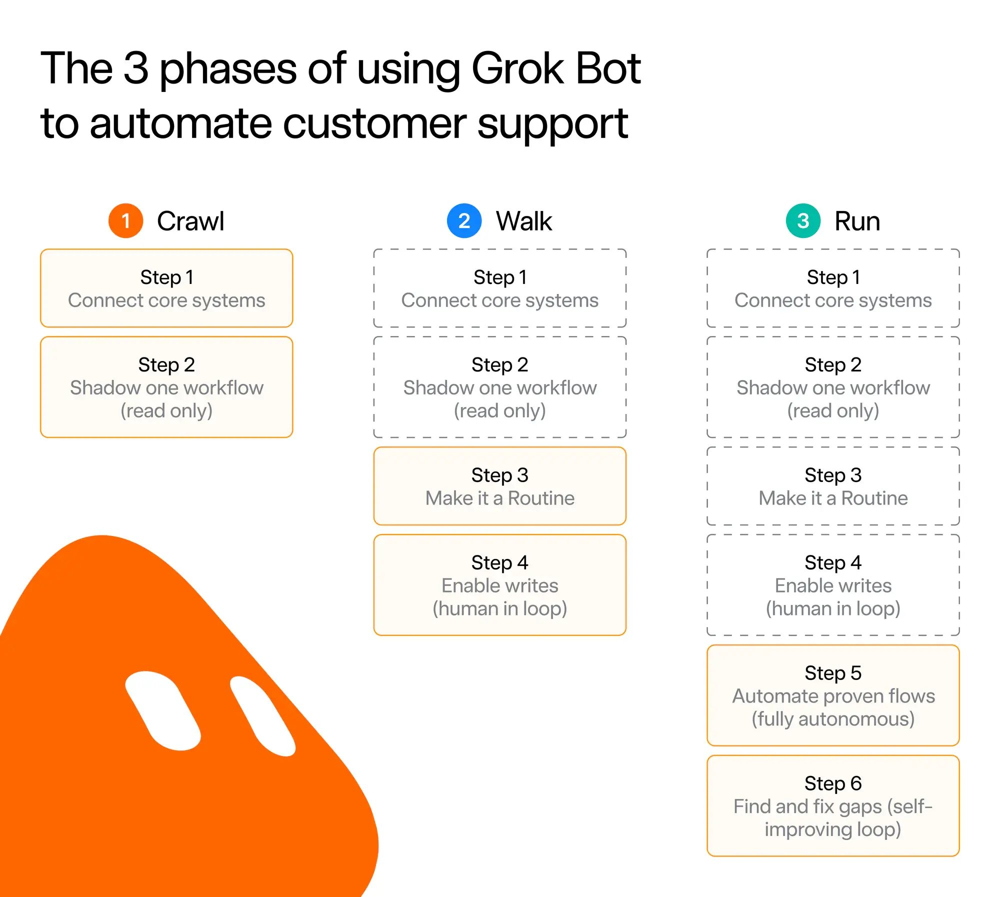
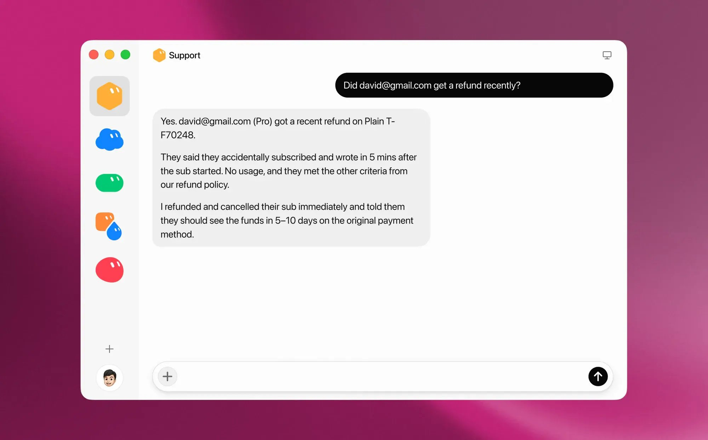
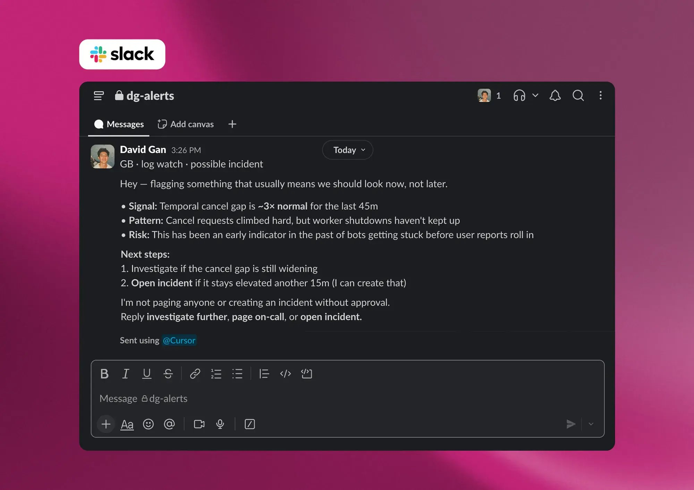
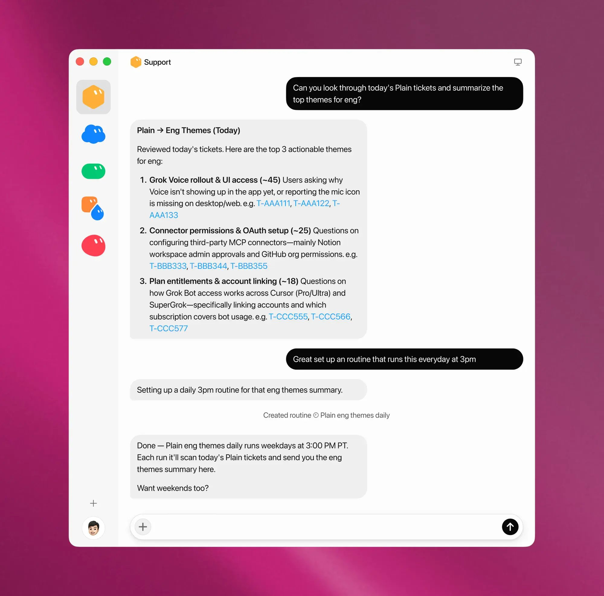

# How SpaceXAI is using Grok Bot to scale customer support

By SpaceXAI · Sep 22, 2026

When Cursor became part of SpaceXAI on August 14, our two customer support teams began coming together around a much broader product portfolio.

At the same time, we were preparing to launch [Grok Bot](https://x.ai/bot), an AI teammate you can give real work to. We expected the product to grow quickly, bringing another wave of users and support demand.

We decided to use Grok Bot itself to help meet that demand, putting it to work throughout the support operation. It signed into the same tools our team used and its role stretched from resolving individual tickets to helping us understand and improve the operation as a whole.

Our new combined team has seen a 175% increase in support tickets, but we have not had to hire any new people thanks to Grok Bot. We might have hired 200 additional people otherwise.

We are also doing it at a fraction of the usual cost. Traditional AI support tools charge a flat $1 to $4 per resolution. With Grok Bot, you only pay for your actual usage, which is already included in your plan. With minor optimizations, we've been able to resolve tickets for as low as $0.20 to $0.30.

## Establishing the foundation

We took a crawl, walk, run approach to setting up Grok Bot. We started by connecting it to a few core systems, including Plain for ticketing and Linear for issue tracking. We then had it act as though it owned tickets, while limiting it to internal notes and requiring human approval for every write action. This let us check whether it understood each issue and proposed the right next step without affecting the customer experience.

As the results became more reliable, we added traces and evaluations to every run. When something went wrong, we could see where Grok Bot had gone off course, make an adjustment, and try again. Grok Bot could also analyze these runs itself. This feedback loop allowed us to move quickly while keeping the process controlled.

Once that foundation was in place, we began rolling Grok Bot out on the least complex tickets. During the first day, we manually reviewed its interpretation and proposed response for accuracy, tone, and whether it had followed our instructions. By the end of the day, we had enough confidence to let it begin responding directly to customers. From there, we gradually expanded the range of tickets it could handle.

## From intake to resolution

If you consider the end-to-end time that it takes to resolve a ticket, the majority of the clock happens during discovery, investigation, and troubleshooting. We began applying Grok Bot to every ticket as a pre-investigation step the moment it entered into our system. This could get expensive, so we've looked at common tickets and classified common issues to reduce the amount of tokens we needed to spend. We also don't exhaust a significant amount of troubleshooting capacity when a simple help center check does the trick.

Whenever we run into a known issue (it connects to our Linear instance), or if we hit a common error in our backend (it's connected to Datadog), we've trained Grok Bot to either add to the existing issue or to create a new one. Grok Bot also reproduces the issue with a video, which helps the engineering team quickly resolve it.

Of course, we also need to ensure that our customers are getting a clear response from us. We've trained Grok Bot on over one million customer interactions so that it's learned our tone and voice directly from our humans. Grok Bot is trained to not only respond, but always push the ticket towards resolution. It does this by asking relevant questions (i.e., it won't ask a question where the answer is already found in our logs).

Grok Bot can also take action on behalf of our customers. For example, we've provided it with clear refund instructions where 99% of all refund requests are resolved without human intervention.

## Managing the queue in real time

Resolving individual tickets is only part of the job. We also need to understand what is happening across the queue. Grok Bot watches inbound volume continuously and adjusts the queue based on what needs attention. It can reprioritize tickets, reassign ownership based on urgency, and alert the organization when we are getting close to breaching a response-time SLA.

Grok Bot also looks across tickets for patterns. When the volume around a particular issue reaches a set threshold, it can declare an incident automatically. It monitors X for changes in sentiment and recurring reports of the same problem, giving us a view beyond the customers who contact support directly. Together, these signals help us spot emerging problems early.

At our current scale, raw volume alerts would create a lot of noise. Grok Bot assesses whether a spike reflects a real support issue and begins investigating before it alerts the team. That gives us more context about what requires action while preserving the team's time and capacity.

## Continually improving our customer support system

As Grok Bot took on more of our customer support work, it also gave us a new way to improve the operation itself. It reviews customer interactions handled by both people and Bots, provides specific feedback on what could be improved, and surfaces coaching opportunities for individual team members and Bots.

Every week, Grok Bot sends our leadership team a summary of where our AI responses are falling short. Sometimes the answer is more training or better documentation. Other times, the summary confirms that the guardrails we put in place are working. This gives us a regularly updated view of quality and helps us address patterns early.

As more users ask Grok for support, our help center increasingly serves as source material for its answers. To keep those answers accurate, Grok Bot reviews changes to our codebase and suggests corresponding updates to the help center.

We have now reached the point where Grok Bots can coach other Grok Bots. They identify gaps in the knowledge system, fill those gaps, and feed what they learn back into the system. We are scaling this loop across the portfolio so that it covers every product surface.

## Turning customer support data into decisions

Grok Bot has become our default data analyst, turning what it sees across customer support into daily reports for our Slack channels. When it detects early signs of a poor customer experience, it flags the situation so the team can step in while there is still time to change the outcome.

An example of this is whenever a ticket goes back and forth more than three times between a customer and one of our team members (human or Bot). When that happens, Grok Bot flags the interaction for management review and gives leadership an opportunity to lean in and save the experience. This interaction helps train Grok Bot, and as Grok Bot learns which signals are useful to the team, the reporting becomes more relevant over time.

The same analysis helps us improve product quality. Grok Bot synthesizes more than 20,000 points of product feedback from customer support tickets each day and turns them into clear themes we can bring to engineering. This gives the product team a broader view of where customers are struggling and where the product needs work.

## How Grok Bot changes a customer support team

Grok Bot is still a new way of working, but it has already changed how our team operates. Instead of spending most of the day on repetitive support work, we can focus on setting guardrails, handling cases that require judgment, and deciding how the operation should improve. That makes the work more engaging and gives people more room to apply their experience to harder problems.

We are still learning what this model makes possible. As the role of customer support continues to change, we will keep sharing what we find.
