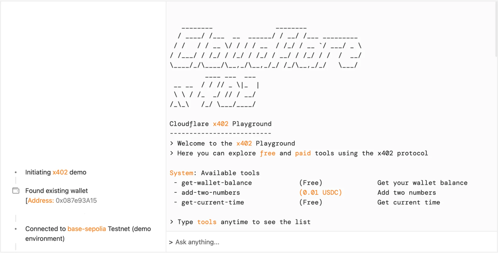

# Launching the x402 Foundation with Coinbase, and support for x402 transactions

By Will Allen, Cam Whiteside, Rohin Lohe, and Steve James · September 23, 2025

Cloudflare is partnering with Coinbase to create the x402 Foundation. This foundation’s mission will be to encourage the adoption of the [x402 protocol](https://github.com/coinbase/x402), an updated framework that allows clients and services to exchange value on the web using a common language. In addition to today’s partnership, we are shipping a set of features to allow developers to use x402 in the [Agents SDK](https://developers.cloudflare.com/agents/x402/) and our [MCP](https://developers.cloudflare.com/agents/model-context-protocol/) integrations, as well as proposing a new deferred payment scheme.

### Payments in the age of agents

Payments on the web have historically been designed for humans. We browse a merchant’s website, show intent by adding items to a cart, and confirm our intent to purchase by inputting our credit card information and clicking “Pay.” But what if you want to enable direct transactions between digital services? We need protocols to allow machine-to-machine transactions.

Every day, sites on Cloudflare send out over a billion HTTP 402 response codes to bots and crawlers trying to access their content and e-commerce stores. This response code comes with a simple message: “Payment Required.”

Yet these 402 responses too often go unheard. One reason is a lack of standardization. Without a specification for how to format and respond to those response codes, content creators, publishers, and website operators lack adequate tools to convey their payment requests. x402 can give developers a clear, open protocol for websites and automated agents to negotiate payments across the globe.

### A Primer on x402

Coinbase authored the x402 transaction flow, outlined below, to help machines pay directly for resources over HTTP:

1. A client attempts to access a resource gated by x402.
2. The server responds with the status code 402 Payment Required. The response body contains payment instructions including the payment amount and recipient.
3. The client requests the x402-gated resource with the payment authorization header.
4. The payment facilitator verifies the client’s payment payload and settles the transaction.
5. The server responds with the requested resource in the response, along with the payment response header that confirms the payment outcome.

This flow creates programmatic access to resources across the Internet. Clients and servers capable of interpreting the x402 protocol are able to transact without the need for accounts, subscriptions, or API keys.

x402 can be used to monetize traditional use cases, but also enables monetization of a new class of use cases. For example:

- An assistant that is able to purchase accessories for your Halloween costume from multiple merchants.
- An AI agent that pays per browser rendering session, instead of committing to a monthly subscription fee.
- An autonomous stock trader that makes micropayments for a high quality real-time data feed to drive decisions.

Future versions of x402 could be agnostic of the payment rails, accommodating credit cards and bank accounts in addition to stablecoins.

### Cloudflare’s pay per crawl: proposing the x402 deferred payment scheme

Agents and crawlers often require two important functions that already exist in much of today's financial infrastructure: delayed settlement to account for disputes; and a single, aggregated payment to make their accounting simpler. For example, crawlers participating in our [private beta of pay per crawl](https://blog.cloudflare.com/introducing-pay-per-crawl/) are able to crawl a vast number of pages easily, generate audit logs, and then be charged a single fee via a connected credit card or bank account at the end of each day.

To account for these types of payment scenarios, we're proposing a new deferred payment scheme for the x402 protocol. This new scheme is specifically designed for agentic payments that don't need immediate settlement and can be handled either through traditional payment methods or stablecoins. By proposing this addition, we're helping to ensure that any compliant server can optionally decouple the cryptographic handshake from the payment settlement itself, giving agents and servers the ability to use pre-negotiated licensing agreements, batch settlements, or subscriptions.

We will be bringing this new deferred payment scheme to pay per crawl as we expand and evolve the private beta.

#### The Handshake Explained

Here’s our initial proposal for the handshake that could be released in the next major version of x402:

##### 1. The Server’s Offer

Today, an unauthenticated or unauthorized client attempts to access a resource and receives a `402 Payment Required` response. The server provides a payment commitment payload that the client can use to construct a re-request. This response is a machine-readable offer, and our proposal includes a new scheme of **deferred**.

```
HTTP/1.1 402 Payment Required
Content-Type: application/json

{
  "accepts": [
    {
      "scheme": "deferred",
      "network": "example-network-provider",
      "resource": "https://example.com/page",
      "...": "...",
      "extras": {
        "id": "abc123",
        "termsUrl": "https://example.com/terms"
      },
    }
  ]
}
```

##### 2. The Client's Signed Commitment

Next, the client re-sends the request with a signed payload containing their payment commitment. The **deferred** scheme uses HTTP Message Signatures where a [JWK-formatted public key](https://datatracker.ietf.org/doc/html/rfc7517?cf_target_id=D4770F028006FD3F2FEE26B65F35A502) is available in a hosted directory. The `Signature-Input` header clearly explains which parts of the request are included in the `Signature` to serve as cryptographic proof of the client's intent, verifiable by the service provider without an on-chain transaction.

```
GET /path/to/resource HTTP/1.1
Host: www.example.com
User-Agent: Mozilla/5.0 Chrome/113.0.0 MyBotCrawler/1.1
Payment:
    scheme="deferred",
    network="example-network-provider",
    id="abc123"
Signature-Agent: signer.example.com
Signature-Input:
    sig=("payment" "signature-agent");
    created=1700000000;
    expires=1700011111;
    keyid="ba3e64==";
    tag="web-bot-auth"
Signature: sig=abc==
```

##### 3. Successful Response

The resource server validates the signature and returns the content with a confirmation header. The server is responsible for attributing the payment to the account associated with the **HTTP message signature**, verifying the client's identity and then delivering the content. In this scenario, there is no blockchain associated with the payments.

```
HTTP/1.1 200 OK
Content-Type: text/html
Payment-Response:
    scheme="deferred",
    network="example-network-provider",
    id="abc123",
    timestamp=1730872968
```

##### 4. Payment Settlement

The server can now handle the settlement flexibly. The validated id from the handshake acts as a reference for the transaction. This approach enables a flexible use model without per-request overhead, allowing the server to roll up payments on a subscription, daily, or even batch basis. This creates a flexible framework where the cryptographic trust is established immediately, while the financial settlement can use traditional payment rails or stablecoins.

### Cloudflare’s MCP servers, Agents SDK, and x402 payments

Running code is what moves an open convention from the theoretical to truly useful, and eventually to a recognized standard. Agents built using Cloudflare’s [Agent SDK](https://developers.cloudflare.com/agents/x402/) can now pay for resources with x402, and MCP servers can expose tools to be paid for via x402. To show how this works, we created the [x402 playground](https://playground.x402.cloudflare.com/), a live demo employing x402. The x402 playground is powered by the [Agents SDK](https://developers.cloudflare.com/agents/) and has access to tools from [MCP servers](https://developers.cloudflare.com/agents/guides/remote-mcp-server/) deployed on Cloudflare.



When you open the x402 playground, a new wallet is created and funded with Testnet USDC on a [Base blockchain testnet](https://docs.base.org/learn/deployment-to-testnet/test-networks). The agent, built with Agents SDK, has access to an MCP server with both free and paid tools.

```
import { McpServer } from "@modelcontextprotocol/sdk/server/mcp.js";
import { McpAgent } from "agents/mcp";
import { withX402 } from "agents/x402";

export class PayMCP extends McpAgent {
  server = withX402(
    new McpServer({ name: "PayMCP", version: "1.0.0" }),
    X402_CONFIG
  );

  async init() {
    // Paid tool
    this.server.paidTool(
      "square",
      "Squares a number",
      0.01, // Tool price
      {
        a: z.number()
      },
      {},
      async ({ number }) => {
        return { content: [{ type: "text", text: String(a ** 2) }] };
      }
    );

    // Free tool
    this.server.tool(
      "add-two-numbers",
      "Adds two numbers",
      {
        a: z.number(),
        b: z.number(),
      },
      async ({ a, b }) => {
        return { content: [{ type: 'text', text: String(a + b) }] };
      }
    );
  }
}
```

When the agent attempts to use a paid tool, the MCP server responds with a 402 Payment Required. The agent is able to interpret the payment instructions and prompt the human whether they want to proceed with the transaction. Building an x402-compatible client requires a basic wrapper on the tool call:

```
import { Agent } from "agents";
import { withX402Client } from "agents/x402";

export class MyAgent extends Agent {
  // Your Agent definitions...

  async onToolCall() {

    // Build the x402 client
    const x402Client = withX402Client(
      myMcpClient,
      { network: "base-sepolia", account: this.account }
    );

    // The first parameter becomes the confirmation callback.
    // We can set it to `null` if we want the agent to pay automatically.
    const res = await x402Client.callTool(
      this.onPaymentRequired,
      {
        name: toolName,
        arguments: toolArgs
    });
  }
}
```

This test agent draws down the funds from the wallet and sends the payment payload to the MCP server, which settles the transaction. The transactions can be specified to execute with or without human confirmation, allowing you to design the interface best suited for your application.

### What’s next?

You can get started today by using the [Agents SDK](https://developers.cloudflare.com/agents/x402/) or by deploying your own [MCP server](https://developers.cloudflare.com/agents/guides/remote-mcp-server/).

We’ll continue to work closely with Coinbase to establish the x402 Foundation. Stay tuned for more announcements on the specifics of the structure very soon.

We believe in the value of open and interoperable protocols – which is why we are encouraging everyone to contribute to the [x402 protocol directly](https://github.com/coinbase/x402). To get in touch with the team at Cloudflare working on x402, email us at [x402@cloudflare.com](mailto:x402@cloudflare.com).
