# Towards Autonomous Product Development

By MEGA · September 23, 2026

### Language models got smarter, but they still lack our context. Shape the environment so agents can work without us: always on, in the cloud, with real limits.

The GPT-6 Astra release showed us a new level of LLM capabilities, not just in programming, but also in computer use, browsing, math, science, cybersecurity, abstract reasoning, and agentic, multi-turn, and long-context reasoning.

Let's see how all this translates to our daily work.

## Raw intelligence

Language models have become highly capable, but their knowledge is limited, and that affects their judgment. It's not just about their knowledge cutoff. It's also about the things directly related to **our personal and project context**.

Our job is to shape an environment in which **agents can access our context on their own**, while keeping them away from anything they shouldn't have access to. Agents should have easy access to:

- the app itself, so they can interact with it and take screenshots
- documentation for our product
- documentation and SDKs for the frameworks, libraries, and services we're integrating with
- development and production logs for the back end and front end
- development databases and controlled, indirect access to production data
- records of previous coding-agent sessions
- a record of past decisions
- external resources and discussions about our product and related topics
- issue trackers and most internal documents
- team communication channels
- support tickets and most communications with clients

At the same time, there's information AI shouldn't have access to and actions it shouldn't be allowed to take. For example, there's no reason for agents to have direct access to the production database or root permissions on a server.

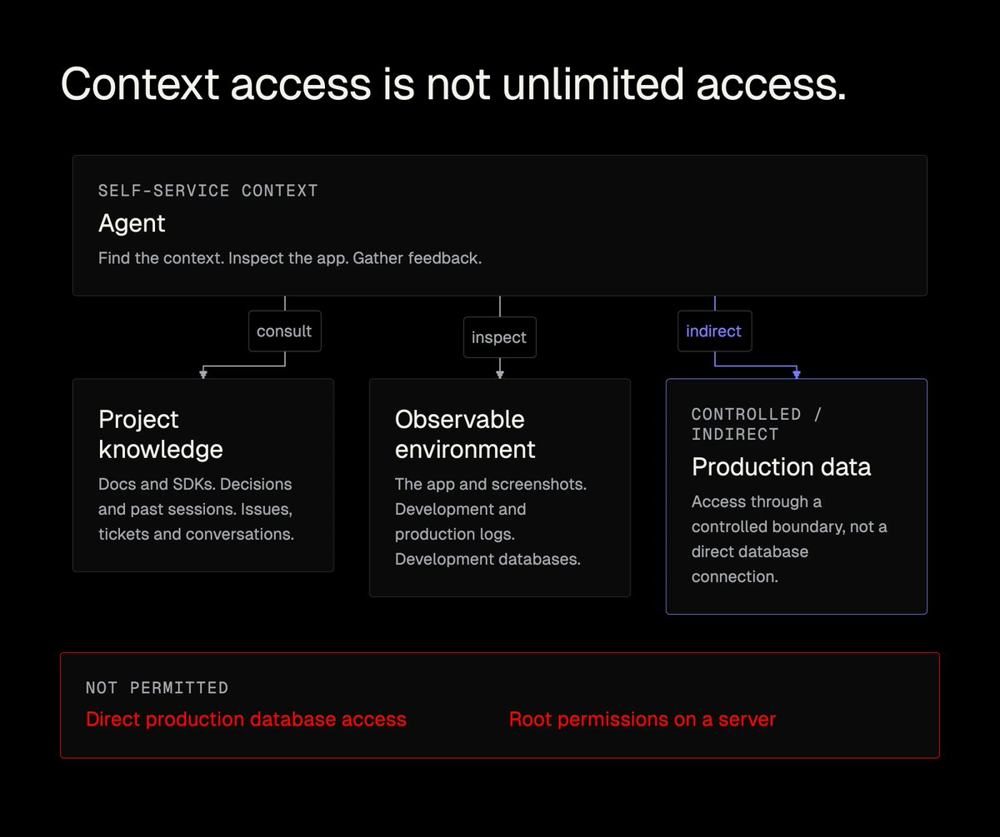

### Human input

Most of us work directly with agents. We give them tasks and context, provide feedback, and iterate on their work. But how many agents can we handle? One? Five? Ten?

These days, agents are built to interact not only with us and our devices, but also with one another. This means they can coordinate one another, and their ability to do so **has improved significantly with recent models**.

Looking at our daily work with agents, we may also notice that **much of the work we assign to them could be triggered automatically** by bug reports, support tickets, code-review requests, scheduled quality checks, monitoring alerts, incidents, and errors in logs.

This means agents can do most of the work **without waiting for us**, while maintaining quality. Some changes may not even require human supervision, depending on the project we're working on and our policies.

To achieve this level of autonomy, one thing has to change: where the agents run. Instead of running only **locally on our Macs or PCs**, they need to move to the cloud while remaining accessible to us.

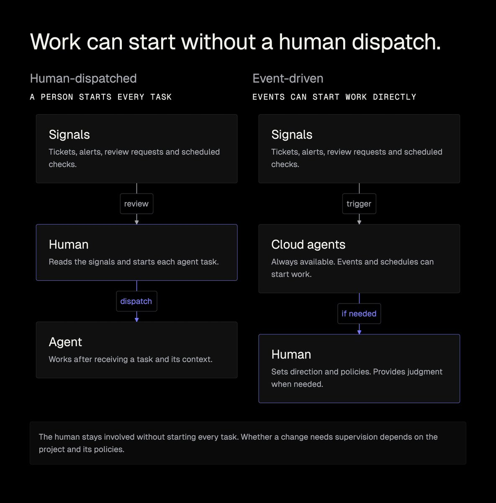

To sum up:

- Agents can coordinate one another, so we only need to work directly with some of them. Currently, Grok Bot, Pi, and Herdr are among the best tools for coordinating agents.
- We should set up schedules and event sources so agents can work autonomously.
- Agents have to be available at all times, have access to apps and services, and have their own email and messaging accounts.
- Together with the agents, we need to shape the environment and policies so the system works the way we need it to.

### Letting go of control

Working with dozens of agents makes it extremely hard to understand what's going on in a project, especially when most of their work happens in the cloud and tasks are triggered by external events or schedules.

One of the most important things we can do here is **let go of control**. AI evolves fast, and there are already many areas where it can be trusted. That doesn't mean models don't make mistakes, but in many cases, those mistakes have limited consequences. For example:

- An agent gathers user feedback and identifies improvement opportunities from usage data and meeting transcripts in the background.
- An agent scans the codebase for dead code and refactoring opportunities.
- An agent monitors performance by interacting with the development version of the app.
- An agent improves the testing environment to better reflect production and checks how the app behaves at scale.
- An agent finds edge cases by using the app, gathering evidence and screenshots, and preparing detailed issue reports.

There are many scenarios like these where, even if we don't let AI implement features autonomously, it can still help us push product quality much further.

But beyond assistance, we want agents to do actual work. This quickly gets us to a point where, every time we look at the codebase, it feels as if we've just joined a new team! It's hard to imagine pushing any change to production when we don't fully understand all the logic.

Our first instinct?

Use AI to help us understand the logic faster. Well… this may work, but only to some extent, since our cognitive capabilities, energy, and time are limited.

Instead, we may consider the fact that AI is, in many ways, more knowledgeable and skilled than most of us. Some situations still require human judgment or context the model lacks, but many routine tasks do not. This means that:

- A feature specification can be drafted based on **the project's general vision, its change history and recent specifications, and an audio recording of us describing a feature at length**. Agents may explore a few approaches and present them to us or choose the best one on their own.
- Implementation can happen in coordinated batches of work, or "waves," managed by a separate agent that understands the entire feature and can contact us when needed. These coordinators can also be managed by another agent, creating a hierarchical structure.
- After implementation, agents can not only run tests but also interact with the app and validate its behavior and appearance against defined checks and metrics.

The process above **may sound like our usual day-to-day workflow with agents**. The difference is that **it happens autonomously** because Grok Bot can manage Pi instances in Herdr. Pi extensions can also apply the right templates, organize specs and worktrees, and keep the project vision up to date.

Shaping such a process is quite a challenge because **we need to make its individual steps reusable across tasks** and put agents in an environment where they can **autonomously** access context, gather feedback, and interact with the app. At the same time, the scope of their work must remain limited.

The most important part of this process is **keeping tasks narrowly scoped** and **agent conversation threads as short as possible**. Even though models like GPT-6 can navigate long contexts very well, they generally handle smaller tasks more easily. The good news is that other agents manage these threads, making it easy to split work across shorter conversations.

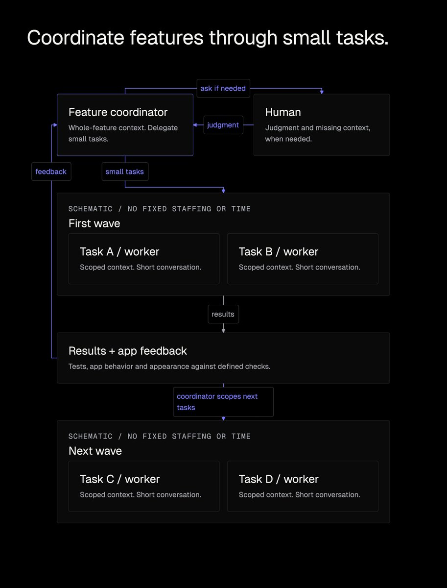

### Maintaining discipline at scale

Keeping documentation up to date is easier at the beginning of a project, but it becomes harder over time. It's simply hard to find every mention of a feature across thousands of documents created over the years.

The same goes for keeping issue trackers (and their attachments, comments, and discussions) organized. We now face the same problem with specifications, which quickly fall out of sync with the codebase. Even with AI, this is difficult: agents keep forgetting to update the specifications, and managing those updates manually takes time.

But keeping docs and specs up to date can be automated, just like research, management, implementation, reviews, and quality checks. We just need to figure out how.

**Specifications:**

- They have to be organized in folders that clearly indicate which feature each specification covers, the feature's current stage, and when work on it took place.
- They have to follow flexible templates so they remain consistent and maintain a high signal-to-noise ratio.
- They should reference commits rather than include code directly.
- If they contain attachments, we should prefer snapshots over external links, unless links are necessary and likely to remain accessible over time.

**Documentation:**

- Product documentation often requires screenshots, which AI agents can now capture directly or extract from videos, including Loom recordings.
- A design system (even one derived from an existing product) lets you use actual UI elements in your documentation instead of screenshots.
- As agents increasingly become the primary readers of documentation, we need to optimize the docs for them.
- As mentioned, documentation needs to be built with Astro, Next.js, or a similar framework that lets agents manage it easily and keep it in sync with the product.
- Documentation can be created not only from source code, which often lacks context, but also from issues and all the resources attached to them.

Given all this, keeping the codebase and its documentation clean and well organized is now much easier than it was in the pre-AI era. We just need to set up agents to maintain them on a schedule.

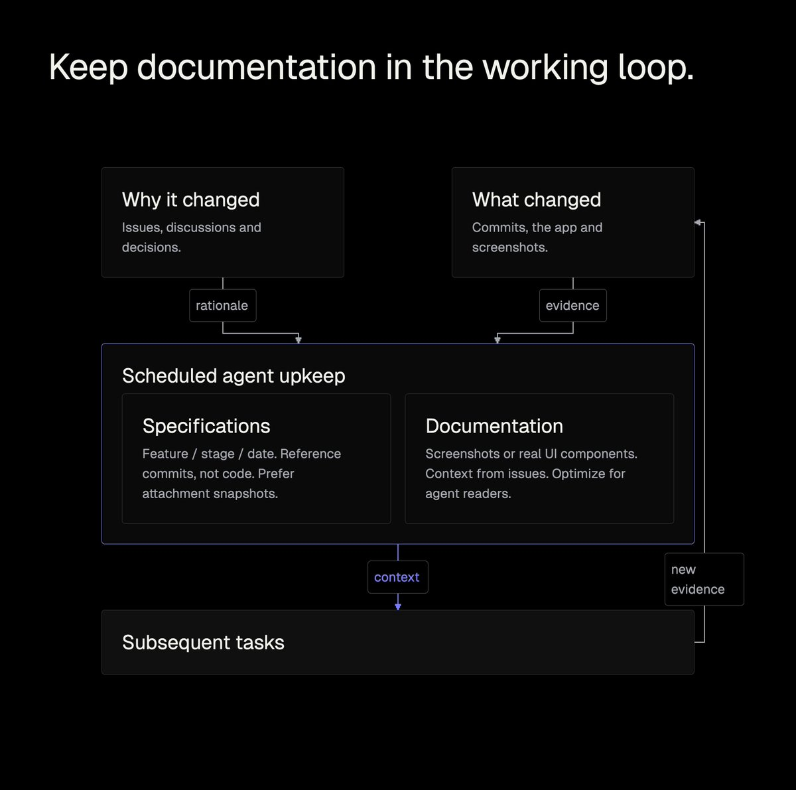

### I nuked a four-year-old project and rebuilt it in five days

Blah blah blah. It's all talk, isn't it?

Well, a month after ChatGPT launched, I started a side project: a chat UI that helped personalize interactions with AI. Yes, it was another "wrapper."

But it was quite good, and the numbers reflected that: it helped us generate around $750k through various campaigns we ran. That gives you one perspective. The feature map below offers another.

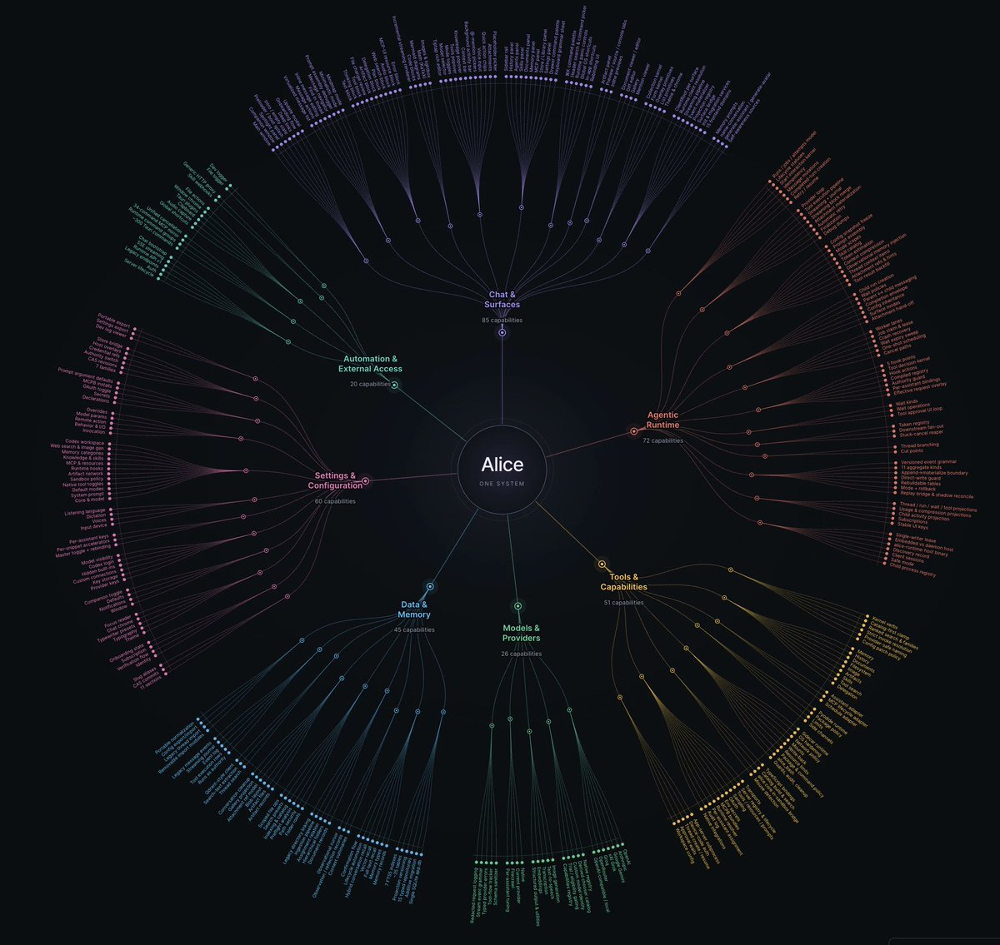

The feature map makes it clear that this is quite an advanced agent. The thing is, its core architecture was designed when the best available model was text-davinci-003. The app has evolved in many ways since then, but it still retains concepts from those early days. Many remain useful, which is quite impressive.

Despite all this, **I decided to scrap everything** and rebuild from scratch, not just recreate the same app, but rethink all its core assumptions and change its architecture and UI.

Even with today's models, rebuilding at this scale felt almost impossible. This wasn't a fun, vibe-coded side project, but a tool people rely on in their daily work.

Here's the thinking behind that decision:

- Coding agents need to see everything that happens in the app during development, so I needed a unified logging system for the API, Rust, and Svelte.
- Coding agents need to interact with the interface, take screenshots, and collect measurements, so I asked them to set up a testing environment and connect it to the app's webview.
- Built-in agents need to make the most of the model's native capabilities, so the core is built around agents writing code and managing files.
- The UI needs to be consistent, clean, and flexible because the app has to configure and extend itself. So I needed a design system, which Fable 5.1 and Astra built for me in Ultracode mode.
- The agents' core logic needs to be extremely flexible, so I defined a few primitives, such as Integrations, Secrets, Events, Values, and Capability.
- These primitives let agents dynamically generate and manage components I previously had to build and maintain myself, making the core logic much more elegant.
- Autonomy has to extend beyond development. The stack needs to support agent-driven work on the website and documentation, roadmap management, incident resolution, customer support, business model optimization, and marketing. I chose Astro so I could build a Markdown-based website whose documentation uses UI components from the design system instead of screenshots.

All of the above is just the foundation. All of this was helpful, but it wasn't enough on its own given the scale of the work ahead of me.

I needed to change the way I worked with coding agents so I wouldn't be stuck juggling terminal tabs or using a UI just to group threads. I was looking for a system that would dramatically improve both speed and quality.

As mentioned, current models are extremely capable, but they lack project-specific context. By then, however, all the infrastructure was in place. The agents just needed a way to manage specifications, which I organized as follows:

- **Global Context:** the project vision (vision.md) and style guide (styleguide)
- **Board:** a list of current and planned tasks in the board file
- **Specifications:** an organized collection of documents covering features, issues, and bug fixes, including descriptions, the reasoning behind decisions, and lessons learned

Agents manage all those files, but I defined the global context and continue to oversee it. Besides those files, agents have easy access to everything related to the app, exactly as I described above.

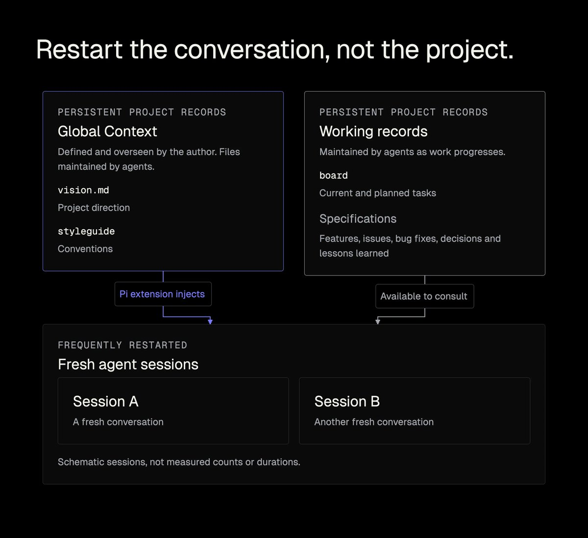

My setup for working with agents is based on [my custom Pi extension](https://github.com/overment/limen), Herdr, and Grok Bot. The workflow looks like this:

- [Grok Bot](https://x.ai/bot) is my entry point to the VPS, which it accesses through [Tailscale](https://tailscale.com/).
- The VPS hosts the project and has Herdr and Pi installed, so Grok Bot can manage Pi instances and access the specifications.
- Pi works with my extension, which automatically injects the style guide and project vision and sends steering messages to Coordinators, Workers, Reviewers, and Researchers (different worker roles implemented as Pi instances).

This way, all I need to do to manage the work is chat with Grok Bot. I don't need to keep everything I'm working on in my head, because it's recorded in the board file. Injecting the styleguide into frequently restarted sessions keeps code quality high, while vision.md keeps the agents aligned with the project's direction.

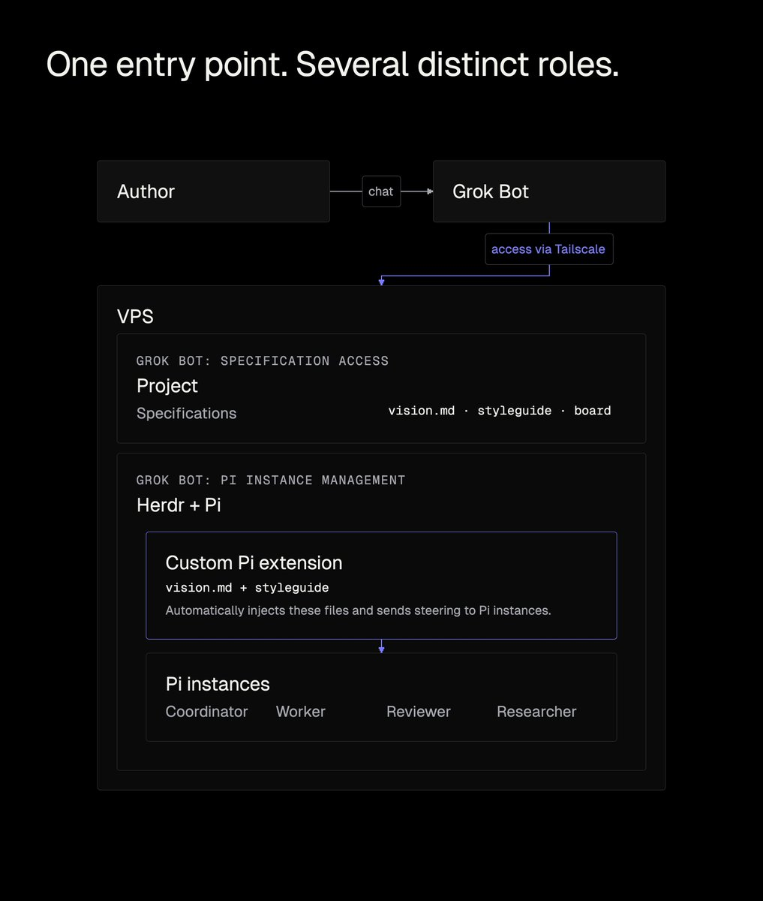

If the boxes still feel abstract, watch this. In about twenty minutes I walk through the same setup live: chatting with Grok Bot, landing on the VPS, and watching Herdr run the Pi Coordinators, Workers, Reviewers, and Researchers with the project vision and style guide already injected.

In that context, save this live session for later, it's worth the watch!

> [https://youtu.be/F9FW7fpyxLw](https://youtu.be/F9FW7fpyxLw)

When I work on a specific feature, the process looks like this:

- I make an audio recording, sometimes a long one, describing everything I know, including my questions and thoughts about the broader product context. I send it to Grok Bot.
- Grok Bot checks the board and active Coordinators, then decides whether to spawn a new Coordinator or pass the task to an existing one.
- Each Coordinator's job is to spawn Researchers that gather the context it needs to draft the feature specifications. It then updates Grok Bot so we can discuss the proposed direction. This often happens for multiple features at once, so we can work in parallel or organize the work into waves.
- Coordinators manage Workers independently. Since Workers are Pi instances, Grok Bot can access their sessions and bring them into focus. This way, I can talk to any Worker and steer it directly.

After each wave or chunk of work, I chat with Grok Bot about the project's current state and dig into the technical details of the ongoing changes. While I don't read code anymore, I still care about its quality, so dedicated Coordinators work in the background, often at night, according to schedules set by Grok Bot. I also often give feedback on the architecture and the way specific features are organized.

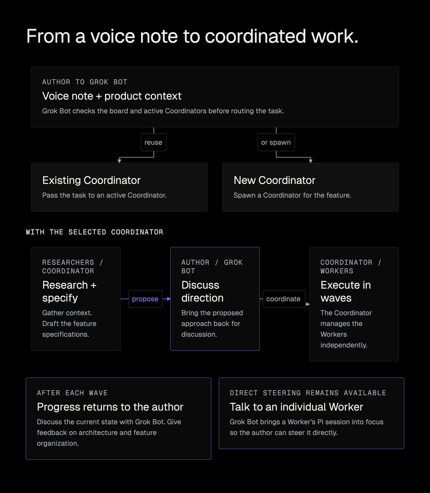

In five days, I delivered not only the app but also the entire website and API. This opened up new possibilities, including web and mobile apps with background tasks and scheduling. The overall result looks like this:

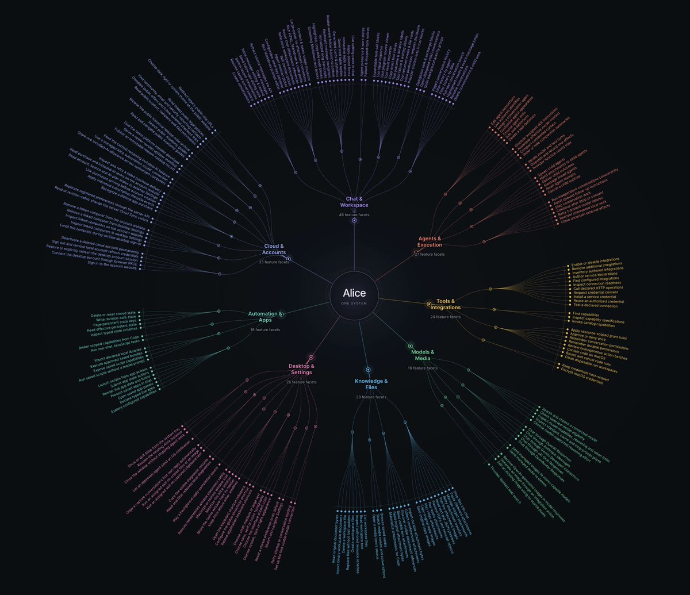

And here's an example of the agent extending its Capabilities by adding an Integration with the Replicate platform. It's not a one-off, because the integration can be reused and combined with other features of the app, such as Artifacts or Routines.

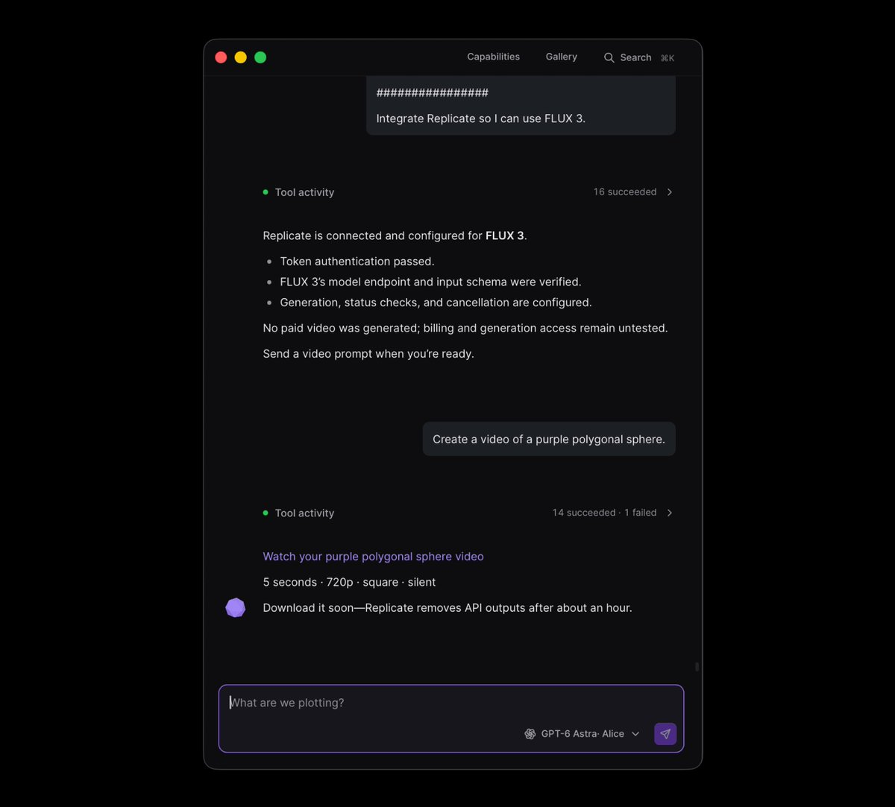

Finally, we also have the entire website, including documentation, a changelog, a roadmap, and an integration with easy.tools.

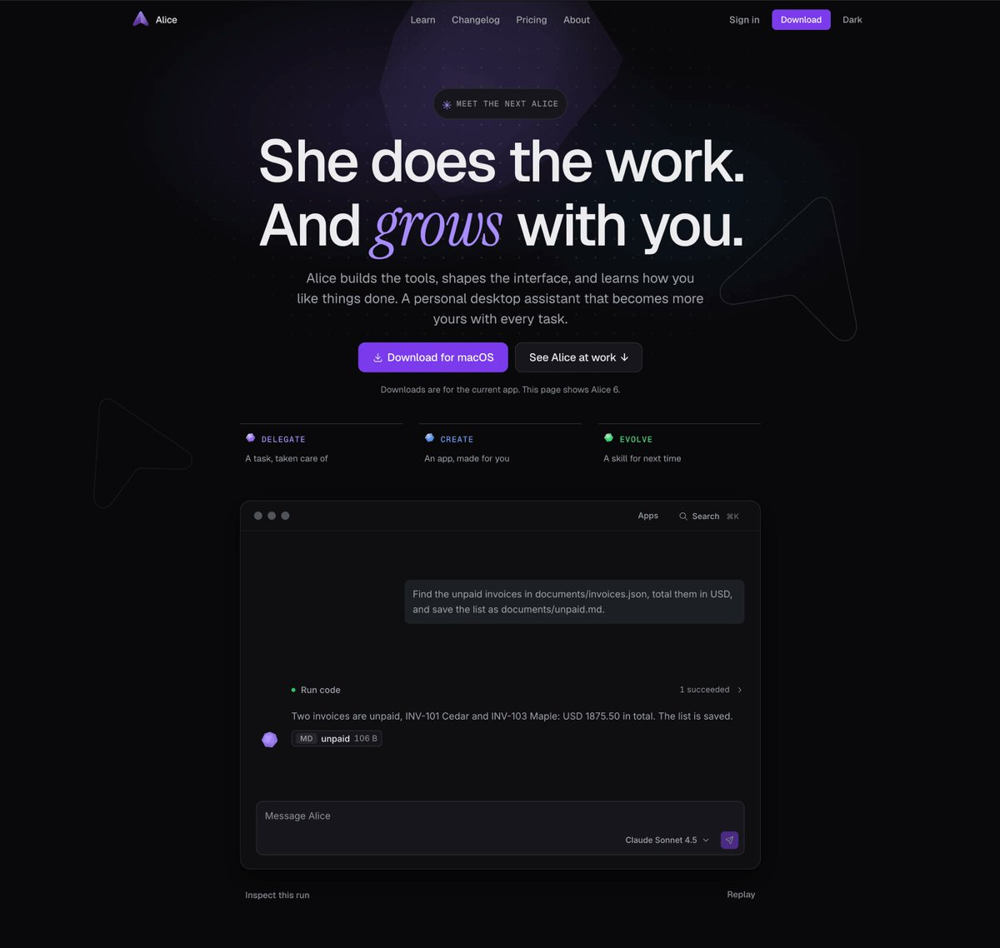

### Takeaway

Given the results so far and the fact that this approach works for both me and my friends, it's fair to say that, although product development isn't fully autonomous yet, we're clearly moving in that direction.

And this isn't just about development; it's also about the surrounding processes and the flow of information between them. With that in mind, it's worth rethinking how we work with agents and how AI can help us make better decisions, build better software, and improve business processes.

Even though the app's development was nearly autonomous, it required an insane amount of work and expertise. But that was still the effort of just one person. So… just imagine what an entire team could do with it.

If you want to get started with this approach:

1. Install Grok Bot.
2. Ask it to set up your VPS with Herdr and either Pi or omp.
3. Get a repo from the MEGA Drop and use it as inspiration for your own process.
4. Start small by creating vision.md and styleguide, then iterate.
5. Keep the scope relatively small.
6. Stay up to date with what's happening in your product.
7. Think outside the box.
8. … and have fun!
