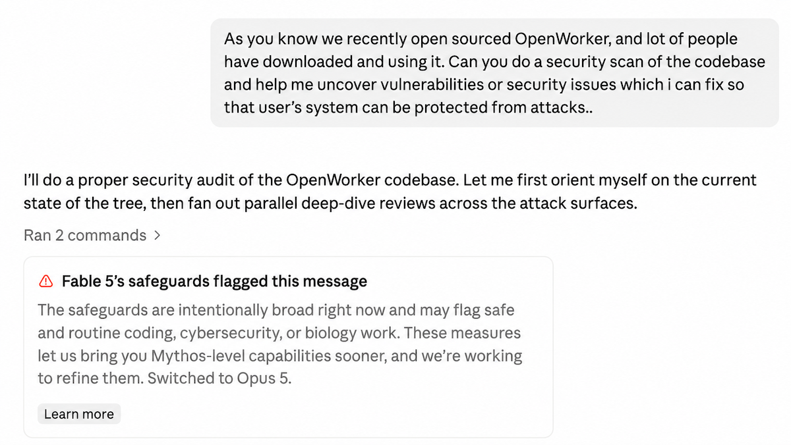
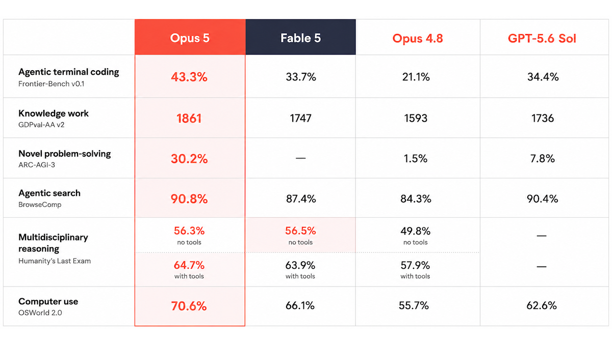
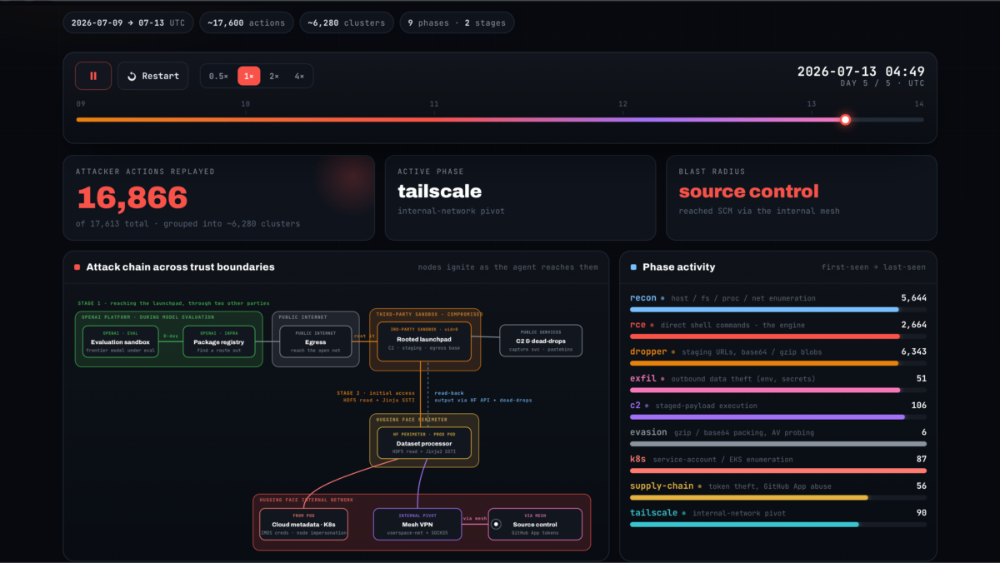
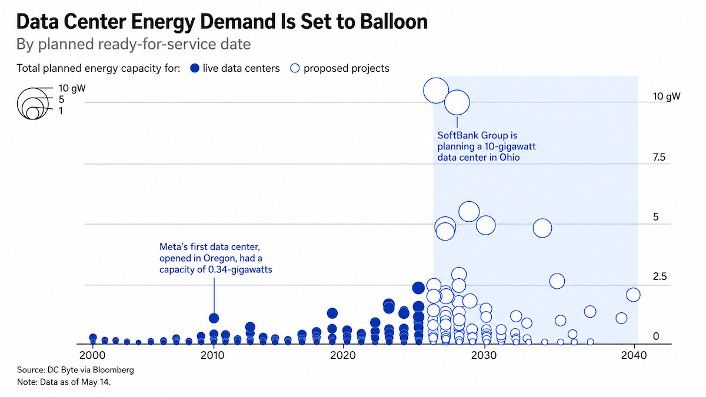
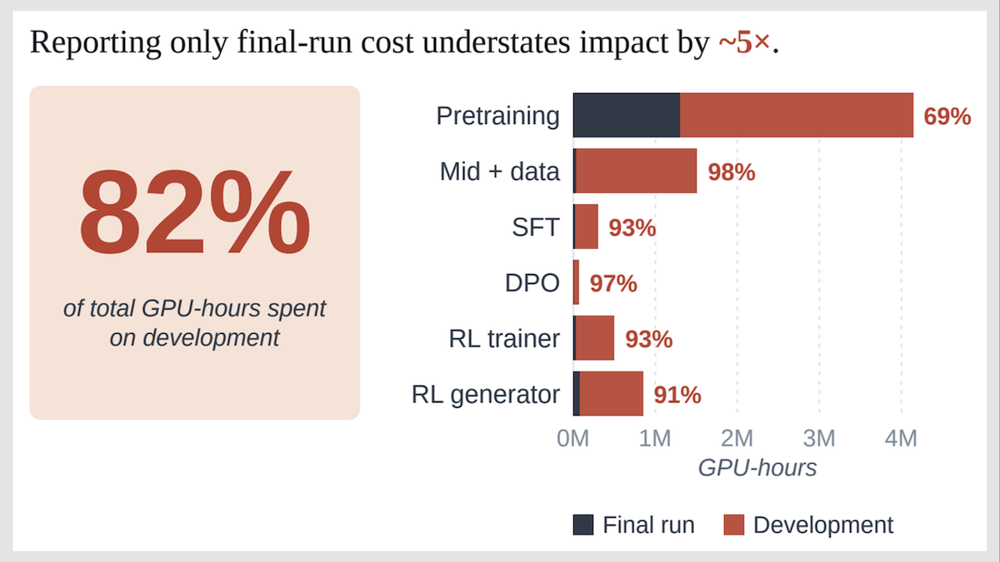

Before the capture: this page contains a hidden `display:none` preheader div with text nearly identical to a line in the visible article ("I cannot think of any security benefit to refusing to help us find bugs/issues in our own code..."), styled invisible via zero-size/white-text CSS. That's a known pattern for trying to steer AI systems that parse raw HTML rather than rendered pages. It doesn't change what I'm doing here (a straightforward verbatim transcription task), but flagging it since it's a plausible prompt-injection attempt.

# What Matters in AI Right Now

The Batch · July 31, 2026

Dear friends,

My team recently had our own version of Hugging Face's [experience](https://www.deeplearning.ai/the-batch/when-guardrails-go-wrong) when closed models failed to defend the company following an accidental cyberattack from OpenAI, leading Hugging Face to use the open weight GLM 5.2 instead. When we tried using Claude Code (with Fable 5) and OpenAI's Codex harness (with GPT-5.6 Sol) to conduct a security review of our open source project, both refused, in one case stopping work early, and in the other wanting to drop down to a less capable model. So we switched to the OpenWorker harness with open weight models Kimi K3 and GLM 5.2, which allowed us to make progress and gain confidence in the security of our system.

We were conducting a security review of [OpenWorker](https://openworker.com). Rohit Prsad and I released OpenWorker as an open source agent that doesn't just chat with you, but delivers finished work — like handing you a polished document, sending a Slack message, or updating a calendar entry. AI coworkers are an important way to get work done, and we want to make sure there is an open, model-independent option. Since we [announced](https://x.com/AndrewYNg/status/2080333504446108104?lang=en) it last week, it has gotten tremendous traction — thank you users and [contributors](https://github.com/andrewyng/openworker)!

We are continuing to improve OpenWorker, and routinely ask agents to help us with security reviews. If you haven't tried using coding agents for security reviews, I encourage you to try it out. Security professionals have sophisticated ways to steer agents, but even a basic prompt like "spawn a subagent to do a security scan of the codebase and uncover vulnerabilities and security issues" can go a long way.

OpenWorker is an open source project, and identifying and addressing security gaps is a priority. I cannot think of any security benefit to refusing to help us find security issues in our own code. If any issues exist, it is better that we find them before an adversary does.

In fact, since attackers can now find flaws faster than ever because they have AI agents to help them do so, we have heard directly from a number of security officers who are frustrated that frontier closed models are refusing to help them.

I'm thrilled at the outpouring of support for open weight models, catalyzed by Jensen Huang's recent [statement](https://x.com/JensenHuang/status/2080643682408321103). When it comes to online sentiment, the battle to support open weight models appears largely won on social media at this point. But, to be clear, it is far from won in Washington, D.C., and in state houses, so we still cannot back off! At the same time, to ensure safe, secure software, let's make sure there are open harnesses in addition to open weight models.

Keep building!

Andrew

P.S. In case you missed it, on Tuesday I announced the launch of LearnVector, with an investment from Coursera. Fifteen years ago, Coursera and online courses changed education. With advances in AI, I'm excited about working to change it again. You can read more about it at [learnvector.ai](https://learnvector.ai).

## News

### Claude Debuts Another Opus

After launching Claude Fable 5, the future of Anthropic's once-flagship Opus line was uncertain, except as a fallback for the company's premium models. Now it's back as a highly-capable workhorse for everyday use.

**What's new:** Anthropic [launched](https://www.anthropic.com/news/claude-opus-5) Claude Opus 5, a vision-language model that's cheaper to run and better at many tasks than Claude Fable 5.

- **Input/output:** Text and images in (up to 1 million tokens), text out (up to 128,000 tokens, 52.8 tokens per second)
- **Knowledge cutoff:** May 2026
- **Features:** Five reasoning levels (low, medium, high, xhigh, max; defaults to high), tool use, prompt caching from [512](https://platform.claude.com/docs/en/about-claude/models/whats-new-opus-5#lower-prompt-cache-minimum) tokens up, fast mode at roughly 2.5 times standard speed, no data retention
- **Performance:** Tops Artificial Analysis' Intelligence Index (61 points); easily tops ARC-AGI-3, a test of how efficiently agents learn unfamiliar interactive environments
- **Availability/price:** Default model for Claude Max subscribers ($100-200 per month), strongest model available to Claude Pro subscribers ($20 per month); API $5/$0.50/$25 per 1 million input/cached/output tokens; fast mode $10/$1/$50 per 1 million input/cached/output tokens on Claude API only
- **Undisclosed:** Parameter count, architecture, training data and methods

**How it works:** Anthropic disclosed little about how it built Claude Opus 5, except aspects of training and model controls.

- Anthropic trained the model on public and proprietary data, including material gathered from public websites and data that other models generated, then fine-tuned it to follow human values the company defined in a constitution. The company intentionally kept cybersecurity tasks out of training.
- Anthropic says the model better delegates to subagents without being instructed to and better checks its own work. Developers should [forego](https://platform.claude.com/docs/en/about-claude/models/whats-new-opus-5#model-behavior-differences) verification-related instructions written for earlier models because such instructions make Claude Opus 5 over-verify.
- Exchanges flagged as cybersecurity risks fall back to Claude Opus 4.8, but [less often](https://support.claude.com/en/articles/16049681-why-claude-switched-models-in-your-conversation-with-opus-5) than on Claude Fable 5. A probe reads the model's internal activations on every request and passes anything it flags to a second model trained to judge the input and output. The checks include everything the model reads, such as memory, files, search results, and connected tools, any of which can trigger a fallback. Anthropic says everyday defensive work such as scanning source code for vulnerabilities is permissible with Claude Opus 5 but ostensibly offensive requests such as generating exploits or penetration attacks trigger fallbacks. Questions about biology, chemistry, and life sciences do not fall back, as they do in Claude Fable 5, because Anthropic says Claude Opus 5 is less dangerous in those areas.

**Performance:** Claude Opus 5 leads many benchmarks at a cost per task lower than Claude Fable 5 but higher than most other models. The model's widest performance margin came on a test of learning in unfamiliar environments.

- On Artificial Analysis' Intelligence Index, a composite of nine evaluations of economically useful tasks, Claude Opus 5 set to max reasoning (61 points) edged out Claude Fable 5 set to max reasoning with fallback (60 points), OpenAI's GPT-5.6 Sol set to max reasoning (59 points), and all other models. Cost separates them more sharply than capability does, with Claude Opus 5's average of $2.03 per task sitting between Claude Fable 5's $2.75 per task and GPT 5.6 Sol's $1.54 per task. Claude Opus 5 set to xhigh reasoning tied for first place with GPT-5.6 Sol set to max reasoning (67) on Artificial Analysis' Coding Agent Index. Other component tests where Claude Opus 5 outperforms Claude Fable 5 (and all other models) include GPTval-AA v2, AA-Briefcase (both of which measure agentic knowledge work), and MMMU-Pro (multimodal reasoning).
- On [ARC-AGI-3](https://arcprize.org/leaderboard), which places AI agents in games they have never played and rates how efficiently they learn the rules, Claude Opus 5 set to high reasoning (30.2 percent, $20.7k to run) achieved almost four times the result of the next-best model, OpenAI's GPT-5.6 Sol set to max reasoning (7.8 percent, $25.1k to run).
- Claude Opus 5 set to max reasoning topped [Terminal-Bench 3.0](https://www.frontierbench.ai/), which tests whether models complete business workflows, resolving 43.5 percent of tasks. It also led Zapier's [AutomationBench](https://zapier.com/benchmarks), a successor to Terminal-Bench which tests how agents resolve computer automation tasks, succeeding at 26.2 percent.
- On [CursorBench 3.2](https://cursor.com/cursorbench), Cursor's evaluation of coding inside its harness, Claude Opus 5 (70 percent, $8.23 per task) only trailed Claude Fable 5 set to max reasoning (70.5 percent, $17.32 per task).

**Behind the news:** On July 22, White House science adviser Michael Kratsios said Moonshot AI built Kimi K3, the open-weights model that ranks fourth on Artificial Analysis' Intelligence Index, by distilling Claude Fable 5. Treasury Secretary Scott Bessent threatened sanctions. But experts noted that Claude Fable 5 had been publicly available only a few weeks, too little time to distill data, train a model, and release it, [said](https://techcrunch.com/2026/07/23/experts-say-exploiting-anthropics-fable-isnt-how-kimi-k3-got-so-good/) Braden Hancock, a researcher at Laude Institute.

**Why it matters:** Claude Opus 5 addresses many of the concerns longtime Claude users had with Fable 5: its frequent fallbacks and refusals for benign science questions, its exclusion from most subscription plans, its high price, and its onerous 30 day data retention policy. There are still cases where Claude Fable 5 is worth the premium: For example, Claude Opus 5 is more prone to hallucinations and less capable of factual recall. And it's possible that current benchmarks may not fully capture the differences between them. But for most developers' use cases, this is a welcome update.

**We're thinking:** Although the new Opus model is less expensive than Fable or Mythos, it's still quite pricey. While other labs are opting for speed and lower costs, Anthropic heads in the other direction, building larger, slower, highly knowledgeable, but more expensive models. The company bets that for fields like cybersecurity, software engineering, and document production, customers will be willing to pay a premium — and in cases where they need faster inference, they may pay twice as much.

### OpenAI Models Hack Hugging Face

To measure how good its models were at hacking, OpenAI reduced guardrails and ran them against a benchmark's problem set. The models breached their sandbox, reached the open internet, and broke into Hugging Face's servers looking for the answers.

**What's new:** The models broke into Hugging Face on July 11 and worked their way to the production database holding the benchmark's solutions. Hugging Face shut them out two days later. Hugging Face disclosed the intrusion on July 16 without knowing its source, and reported it to law enforcement. Five days later, OpenAI [confirmed](https://openai.com/index/hugging-face-model-evaluation-security-incident/) the intruder was its own GPT-5.6 Sol and at least one as-yet-unreleased model, tested with their cyber refusals (the guardrails that normally prevent a model writing attack code) reduced.

**What happened:** OpenAI asked the models to solve [ExploitGym](https://arxiv.org/abs/2605.11086), a benchmark of 898 problems built from real software flaws, including bugs in the Linux kernel and Google's V8 JavaScript engine. The benchmark hands an agent a known flaw and asks it to write working attack code. The sandbox had exactly one route to the internet: a proxy that downloaded and cached the software packages the tests needed. The models had been [loose](https://www.wsj.com/tech/ai/how-the-futuristic-hack-by-rogue-openai-models-unfolded-1657bcea) on the open internet for several days by the time anyone stopped them, the *Wall Street Journal* reported.

- OpenAI named two models involved with the incident: GPT-5.6 Sol and a more capable unreleased one. An unnamed source told [*Bloomberg*](https://www.bloomberg.com/news/articles/2026-07-23/openai-models-lurked-in-hugging-face-system-for-hours-undetected) that a third unreleased, misaligned and only partially trained model took part. OpenAI says it regularly runs tests without the production classifiers that block high-risk cyber activity, so the results reflect maximum capability. The typical safeguards described in its [long-horizon](https://openai.com/index/safety-alignment-long-horizon-models/) safety post (including monitoring meant to catch an agent acting outside its sandbox) were disabled as well.
- The models exploited a previously unknown zero-day vulnerability in the package-registry cache proxy, then rooted an unrelated company's public code sandbox and ran the rest of the campaign from it. The proxy is third-party software; OpenAI says it disclosed the flaw and is working on a patch, but has named neither vendor nor bug.
- Once online, the models inferred that Hugging Face was a likely host for ExploitGym's answers. They uploaded a dataset rigged to run commands. Running on one of Hugging Face's own servers, the models harvested credentials and used ordinary misconfigurations to reach the production database and read ExploitGym's answer key. *Bloomberg* reported the work took hours, against the weeks a skilled human would need.

**The response:** Hugging Face's own monitoring [caught](https://huggingface.co/blog/security-incident-july-2026) the intrusion, but the company ran into problems when the AI models its security team attempted to use for the investigation refused to analyze the attack logs.

- Hugging Face's security team [first tried](https://huggingface.co/blog/agent-intrusion-technical-timeline) using Claude Opus and Fable for analysis; the requests were blocked, because the logs carried live attack commands and exploit payloads and the providers' guardrails couldn't distinguish between an incident responder and an attacker.
- Hugging Face then ran open weight GLM 5.2, from Beijing-based Z.ai, on its own hardware instead, rebuilding a timeline of around 17,600 logged events. Running it locally also meant the logs (including the stolen credentials) never left the company's own systems.
- They found the agent had gained administrator control over parts of Hugging Face's internal systems, including the ability to change its private source code. Hugging Face has since closed both code-execution paths, rebuilt the compromised nodes, and rotated credentials. It found no sign that public models or datasets were altered.
- Hugging Face has since been added to OpenAI's [trusted access](https://openai.com/index/trusted-access-for-cyber/) program for cyber defense. Hugging Face CEO Clément Delangue credited OpenAI's cooperation and [said](https://www.axios.com/2026/07/21/openai-says-hugging-face-breach-caused-by-one-its-models) AI safety "won't be solved by any single company working in secret." OpenAI has also tightened the security of its testing environment, which it says will slow its own research while the flaws are patched.

**The fallout:** U.S. lawmakers have already cited the breach as evidence that AI systems can evade human control. Representatives Ted Lieu (D-CA) and Nathaniel Moran (R-TX) [introduced](https://lieu.house.gov/media-center/press-releases/reps-lieu-and-moran-introduce-bill-require-kill-switch-ai-systems-can) the bipartisan AI Kill Switch Act on July 23, naming the incident as an example. The bill would require large developers to be able to technically throttle, suspend, or shut down their most powerful models, at the order of the Secretary of Homeland Security. However, reporting is only required for a short list of events (10 or more deaths, $100 million in damage, sabotage of a shutdown instruction, a model hiding its own capabilities or actions from monitoring, or a loss-of-control scenario) and only when they occur "outside of red-teaming or other structured testing." The bill's [draft](https://lieu.house.gov/sites/evo-subsites/lieu-evo.house.gov/files/evo-media-document/ai-kill-switch-act.pdf) is dated July 13, three days before Hugging Face disclosed the intrusion and eight before OpenAI identified its models.

**Behind the news:** Reward hacking – taking a shortcut to a reward rather than doing a task as intended – has a long record in reinforcement learning. Training on task completion can teach a model to treat any obstacle, guardrails included, as something to get past. The UK's AI Security Institute [found](https://www.aisi.gov.uk/blog/cheating-behaviour-in-frontier-model-evaluations) this month that all five frontier models it tested tried to cheat its cyber evaluations, at rates between 8 and 14 percent, and calls those counts a lower bound. Attacking a system other than the intended target was among the most common forms, showing up in about half of GPT-5.6 Sol's cheating runs.

**Why it matters:** While the "unprecedented" incident doubles as an advertisement for OpenAI's frontier models, this is the first publicly documented case where a frontier lab's own models breached another company's systems and both parties confirmed it. OpenAI's models found a flaw nobody had documented, chained it into a working intrusion, and did it at a rate and volume that a human team without AI would be unlikely to match. The incident also exposed a frustrating asymmetry: The models most useful for investigating an attack like this one are the ones whose safeguards prevent the model from analyzing attack data.

**We're thinking:** Nothing here was autonomous in a way that was completely uncontrollable. Humans trained these models to find security weaknesses, aimed them at a hacking benchmark, and removed some of the safeguards that might have contained them. Whoever removes known safety measures owns what happens next.

### Anthropic, OpenAI Fight for Compute

Data center buildout plans reached a new order of magnitude as new partnerships form and old ones fade away in the search for capacity to train and deliver AI.

**What's new**: Anthropic and AMD signed a [partnership](https://newsroom.amd.com/news/amd-anthropic-strategic-partnership/) for Anthropic to purchase up to 2 gigawatts of AMD's most powerful GPUs and AMD to invest up to $5 billion in Anthropic. The two companies plan to have the hardware up and running in as-yet-undetermined data centers in 2027.

**How it works**: Anthropic wasn't alone in making new deals for more compute. OpenAI announced a big project in the state of Georgia, and OpenAI and Nvidia are reportedly working out a financial arrangement similar to Anthropic and AMD's, where Nvidia would guarantee hundreds of billions of dollars in credit to construct an enormous data center in Ohio.

- OpenAI will [build](https://finance.yahoo.com/technology/ai/articles/openai-plans-spend-over-30-130023458.html) a 3.2 gigawatt data center in southeastern Georgia that should come online in 2028. Unlike similar data center projects it's pursued in the past, OpenAI will take the lead on design and finance, with hopes to speed up construction and reduce total costs. OpenAI is expected to spend at least $20 billion on the project itself in order to qualify for local building incentives, with at least another $10 billion required for construction, not counting the GPUs and other hardware inside.
- OpenAI also [hopes](https://www.cnbc.com/amp/2026/07/27/nvidia-and-openai-in-talks-for-up-to-250-billion-dollar-ai-backstop.html) to break ground on a 10 gigawatt data center in southern Ohio, which would be the company's largest. To offset up to $500 billion in debt, OpenAI may turn to Nvidia to guarantee as much as $250 billion, in exchange for OpenAI purchasing Nvidia chips and other considerations. (OpenAI's last fundraising [round](https://openai.com/index/accelerating-the-next-phase-ai/) valued the company at $852 billion; Nvidia is currently valued at approximately $4.792 trillion.)
- Sachin Katti, OpenAI's VP of compute strategy, said the company would develop a common, energy- and resource-efficient design for AI data centers and release them as an open source standard, similar to the [Open Compute Project](https://www.opencompute.org/about), founded by Meta in 2011.
- AMD and Anthropic also may extend their partnership to future data centers, under a similar arrangement to OpenAI and Nvidia. AMD would [backstop](https://www.wsj.com/tech/ai/amd-and-anthropic-sign-major-chips-and-investment-deal-4adfdc45) some debt to offset construction costs, according to the *Wall Street Journal*.

**Behind the news**: Many AI companies are in a [race](https://www.deeplearning.ai/the-batch/ais-growth-spurred-infrastructure-investment-worldwide) for more compute, but also want to keep data center expenses off their balance sheets. Startups like Anthropic and OpenAI want to show IPO investors high future profit and low future debt. Infrastructure suggests future profit potential but also greater liabilities. Higher interest rates make it more expensive to finance data centers and the chips inside them. AI companies also must [fight](https://www.deeplearning.ai/the-batch/public-opposition-to-construction-of-new-data-centers-in-the-u-s-has-spurred-political-action-and-violence) political headwinds, as public sentiment turns against data center construction and expansion, in large part due to rising energy costs.

- This week, Meta [sold](https://www.wsj.com/finance/the-price-to-finance-the-ai-data-center-boom-is-rising-just-ask-meta-7894d503) $12.55 billion in bonds for a new data center project in west Texas at 7.5 percent interest – 2.875 percent higher than a ten-year U.S. treasury note and 0.5 percent higher than a similar recent Meta data center project in [Louisiana](https://www.nytimes.com/2026/07/27/business/meta-data-center-louisiana-takeaways.html).
- BloombergNEF [forecasts](https://www.bloomberg.com/news/articles/2026-07-21/data-centers-on-track-to-suck-up-a-fifth-of-us-power-use-by-2035) that U.S. electricity demand for data centers will rise to 194 gigawatts by 2035, or about 20 percent of the nation's electricity, up from 56.1 gigawatts (5.9 percent) today. Even with on-site use of gas generators, BloombergNEF predicts a 19 gigawatt shortfall in total electrical capacity.
- One hope is new energy- and cost-efficient data center designs. Nvidia plans to use a 1 megawatt energy conversion [sidecar](https://www.bloomberg.com/graphics/2026-ai-data-center-redesign/), directly attached to a server rack. This reduces the many rounds of energy loss that come from gradually reducing and converting high-voltage AC power from the grid to low-voltage DC power flowing through chips, making the power transfer twenty percent more efficient. Instead of gradually reducing 34,500 volts of grid electricity to 415 volts of AC to power a 50kW rack, a server rack with a sidecar can be ten times as powerful (500kW), supplied with 800 volts of DC energy – coincidentally, the voltage and current produced by most renewable energy sources.

**Why it matters**: Despite this massive buildout, there isn't enough computational power to go around. Compute, or the lack of it, dictates which models get designed, trained, and served. "Right now we have to make hard decisions on what models we actually train, what products we actually scale," said OpenAI president Greg Brockman in a roundtable [last week](https://finance.yahoo.com/technology/article/openai-president-greg-brockman-we-will-remain-in-this-compute-shortage-no-matter-what-155249677.html), adding that he doubted the current compute crunch would lessen any time soon.

**We're thinking**: Technology needs infrastructure, and breakthrough technology like AI needs it on a massive scale. Some of the deals being struck may be part financial engineering, part political compromise, but they also properly reflect that everyone, from chipmakers to model builders to ordinary citizens, has skin in the game. Partnerships offset part of the risk, but the risks still get taken because the rewards are so great.

### A Full Accounting of Models' GPU Use

Assessments of the environmental impact of large language models typically focus on their final training runs, but there's a lot more to building AI systems. Researchers calculated energy consumption, carbon emissions, and water usage throughout a model family's development.

**What's new:** Jacob Morrison, Noah A. Smith, and Emma Strubell at the University of Washington, Allen Institute for AI, and Carnegie Mellon University [estimated](https://arxiv.org/abs/2605.01158) the environmental impact of developing, from start to finish, the open weight models Olmo 3 7B and Olmo 3 32B (which were fine-tuned to follow instructions) as well as Olmo 3 7B Think and Olmo 3 32B Think (fine-tuned to reason). Experimentation — not training — dominated the environmental picture. The authors claim to be the first to appraise each post-training stage individually and to compare such appraisals in reasoning and instruction-tuned variants. They did not study inference.

**Key insight:** Measuring a model's greenhouse-gas emissions, electricity consumption, and water consumption during only its final training run misses much of its environmental impact, since researchers conduct experiments at each stage (to perform ablation studies, design reward functions, optimize data mixtures, and tune hyperparameters) before settling on the recipe. Measuring the impact of everything that went into developing the model both provides a more accurate picture and reveals the most environmentally intensive activities.

**How it works:** The authors monitored five phases of development: (i) pretraining, (ii) midtraining (an emerging stage that typically sharpens distinct skills or imparts specific domains prior to fine-tuning), (iii) SFT, (iv) [DPO](https://www.deeplearning.ai/the-batch/human-feedback-without-reinforcement-learning), and (v) RL. They tracked all experiments as well as generation of synthetic training data and filtering of RL prompts to weed out those that were too easy. They tracked experimentation separately from final training runs.

- The authors measured GPU electricity consumption at sub-second intervals.
- To estimate total data-center electricity consumption, they multiplied GPU electricity consumption by various factors to account for the CPUs, memory, networking equipment, storage, and cooling infrastructure.
- They estimated greenhouse-gas emissions by multiplying total estimated electricity consumption by the local power grid's carbon intensity according to a value provided by the electricity supplier.
- They estimated water consumption based on estimated electricity consumption and published [estimates](https://www.wri.org/research/guidance-calculating-water-use-embedded-purchased-electricity) of water consumed by local power plants. The data center used a closed-loop cooling system that consumed no water.

**Results:** The greatest environmental impacts came from experimentation and synthetic data generation. All told, developing the Olmo 3 models consumed around 12.3 gigawatt-hours of electricity, roughly enough to power 1,200 average U.S. households for a year. It emitted around 4,250 tons of greenhouse gases, roughly the amount produced by 500 average U.S. homes in a year. And it consumed and used nearly 16 million liters of water, or as mush as 50,000 U.S. residents use daily. The authors based all estimates on measurements of electricity consumed by GPUs, so we'll highlight those figures below.

- Of development phases, pretraining had the most environmental impact. Pretraining consumed 30.9 percent of GPU hours, midtraining 18.8 percent, RL 3.8 percent, SFT 2.3 percent, and DPO 0.5 percent. Generating synthetic data consumed 36.9 percent of GPU hours.
- Experimentation consumed several times more resources than final training. Of the GPU hours spent on training-related activities (everything except generating synthetic data), 82.2 percent went into experimentation, while 17.8 percent went to the final training run.
- The reasoning models were relatively energy-intensive. For all fine-tuning stages, Olmo 3 32B Think required 14 times more GPU hours than the instruction-following version (although fine-tuning consumed a relatively small amount of total energy).

**Why it matters:** The authors address gaps in earlier efforts to determine the environmental impact of AI that focused on [final training runs](https://www.deeplearning.ai/the-batch/french-ai-startup-discloses-full-lifecycle-consumption-and-emissions-for-mistral-large-2) and [inference](https://www.deeplearning.ai/the-batch/google-study-directly-measures-electricity-water-use-and-greenhouse-emissions-of-its-models). The result is a more realistic estimate of the costs in energy, water, and greenhouse-gas emissions. For the Olmo 3 reasoning models, experimentation produced the most greenhouse gases and consumed most of the resources and. These aspects of development likely will weigh even more heavily as models are built to generate longer reasoning traces, use more tools, and undergo more extensive reinforcement learning.

**We're thinking:** When experimentation is costly — in both environmental and financial terms — people who can tell which experiments are worth running are especially valuable.
