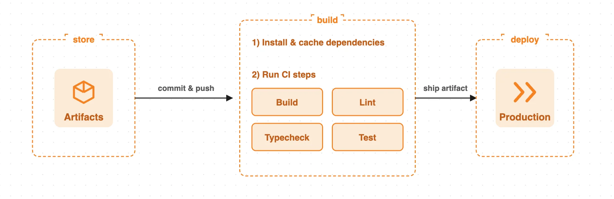
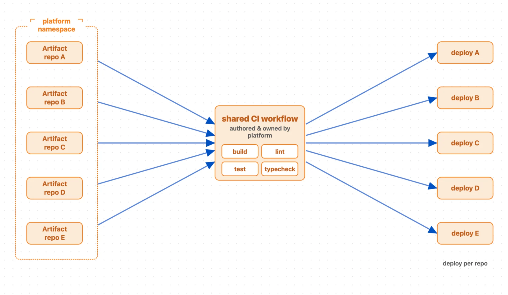
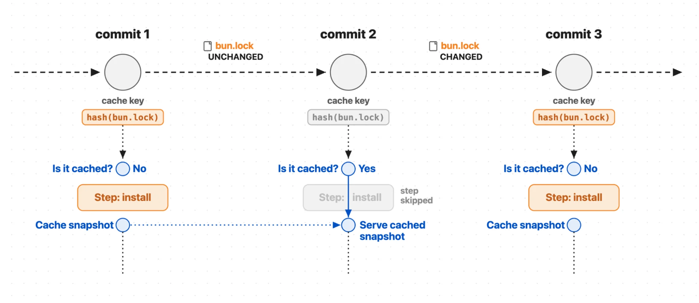
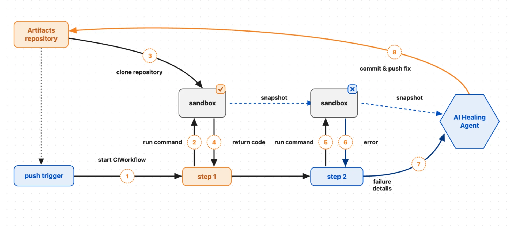
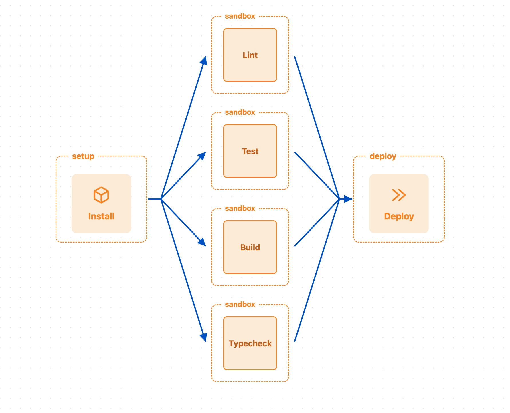

# Run CI/CD for millions of repos — on your platform, on Cloudflare

By André Venceslau, Mia Malden, and Tomáš Hobza · August 4, 2026

We are moving toward a world in which you can store, build, test, and deploy your code fully on Cloudflare. We built the first piece with [Artifacts](https://developers.cloudflare.com/artifacts/), versioned code storage that scales to millions of repos.

We have stitched the store, build, and deploy steps together with the [CI SDK](https://github.com/cloudflare/ci), built on [Cloudflare Workflows](https://developers.cloudflare.com/workflows/), so that you can run your continuous integration (CI) pipeline on Cloudflare. You can send `artifact push` events directly to your Workflow, triggering an instance of its execution — a CI job, essentially — through a new `events` field in your wrangler configuration file.

Then, directly from the Workflow with [@cloudflare/ci](https://www.npmjs.com/package/@cloudflare/ci) installed, you can:

- Automate builds: compile code from your Artifacts repo in a safe, isolated environment
- Run linters and typechecks: enforce code style, catch type errors, and flag any potential issues
- Cache dependencies: run your `install` once and cache dependencies across steps in the CI job
- Execute unit tests: verify that each piece of your code works as expected
- Self-heal: integrate an AI review agent to catch broken steps in your build and push commits to fix
- Deploy conditionally: automatically deploy your code, only if your build step is successful



Today, everyone is building a platform, whether it’s an internal vibe coding platform or an extension of your customer-facing product via customization through code. [Platforms are now using millions of repos on Artifacts](https://x.com/dillon_mulroy/status/2077508376217452866) to store their code, and their customers’ code, and version control across the two. But every team has their own needs for a continuous integration and deployment pipeline. For platforms, they might want to define a CI job for their own code differently from that of their customers.

Many of the end customers building on these platforms don’t want the extra headache of managing their continuous integration and continuous deployment (CI/CD) pipeline. Instead, the platform can manage the build process on their customers’ behalf: write the CI/CD pipeline once and share it across all the applications that their customers are building. Some of the platform’s customers might want to define their own CI; if so, they can write their own Workflow and run custom CI jobs on just their repo, facilitated by [dynamic workflows](https://blog.cloudflare.com/dynamic-workflows/). The beauty is, you don’t have to pick and choose: both platform-managed and custom CI can run at the same time, in the same namespace.



## A CI/CD pipeline is just a Workflow

Before today, we had all the pieces to allow platforms to wire their CI/CD pipeline together on Cloudflare. Now, we’re bringing a better developer experience to make it simple.

A CI/CD pipeline — commonly orchestrated with GitHub Actions — is a series of steps that run in a specific order where, if any step fails, you stop running the pipeline and report the error. In essence, a CI/CD pipeline is just a Workflow. CI/CD, when defined by a YAML file, can get complicated quickly, given the constraints that so often lead to YAML fatigue. But each step in a CI/CD pipeline can translate simply to a Workflow `step.do()`. Instead of YAML, you can define your CI/CD pipeline in Typescript for greater customization and configurability.

We are launching new tools in the [CI SDK](https://github.com/cloudflare/ci) that allow you to run each step in your CI pipeline (e.g. `build`, `lint`, and `typecheck`) in a safe, isolated environment, built directly on Cloudflare’s developer platform via Workflows and the [Sandbox SDK](https://developers.cloudflare.com/sandbox/). Plus, you can now kick off a CI job directly on push instead of configuring an event subscription, a queue, and a queue consumer.

Previously, you’d have to call the Sandbox API directly and manage state yourself across different steps in the CI pipeline. The SDK allows you to run each sandboxed command in its own Workflow step, providing the retries and timeouts built into Cloudflare Workflows.

You can also speed up your CI pipeline by caching step results — for example, your install step — so that you don’t need to reinstall for all subsequent operations. Dependency caching reduces the latency of your CI/CD pipeline since every CI step won’t need to rerun the install.



To define your CI job, all you need to do is:

1. Define your `install` step for any dependencies (external packages or tools that your CI job needs), such as [bundlers](https://developers.cloudflare.com/workers/wrangler/bundling/) (e.g. [esbuild](https://esbuild.github.io/)), linters (e.g. [eslint](https://typescript-eslint.io/)), or [test runners](https://developers.cloudflare.com/workers/testing/vitest-integration/test-apis/) (e.g. [vitest](https://vitest.dev/)).
2. Specify the command for each step in the CI job (e.g. `bun run build`, `bun run test`, `bun run lint`). With your dependencies cached, each CI step can execute in parallel, reducing the latency of the overall run.
3. Pass `wrangler` `deploy` in a `deploy` step. Your Worker will automatically deploy when the CI pipeline passes.

```
const deps: CiRunnerResult = await ci.runner({
  name: 'install',
  command: 'bun install --frozen-lockfile',
  cache: { inputs: ['package.json', 'bun.lock'] },
});

await Promise.all([
  deps.runner({ name: 'lint', command: 'bun run lint' }),
  deps.runner({ name: 'test', command: 'bun run test' }),
  deps.runner({ name: 'typecheck', command: 'bun run typecheck' }),
  deps.runner({ name: 'build', command: 'bun run build' }),
]);

await deps.runner({
  name: 'deploy',
  command: 'bun wrangler deploy',
  cloudflareCredentials: {
    accountId: this.env.CLOUDFLARE_DEPLOY_ACCOUNT_ID,
  },
});
```

Writing your own CI pipeline in a Workflow allows you to customize as much as you want. For example, you could call an agent from your CI Workflow to give your CI jobs self-healing functionality: if a step in your build errors, the agent can fix it automatically, and push a commit for your approval.



Try an example of self-healing CI Workflows with Project Think: [https://github.com/cloudflare/ci/blob/main/examples/self-healing](https://github.com/cloudflare/ci/blob/main/examples/self-healing)

## Write your own CI Workflow

To write your own CI Workflow, get started with `import { CIWorkflow } from@cloudflare/ci`.  
Start with an `install` step:

- Download your dependencies, including any external tools or libraries that your CI steps will need (e.g. `vite`, `react`).
- Specify your lockfile, which tracks whether your dependencies have changed.
- Cache your dependencies via a [sandbox snapshot](https://developers.cloudflare.com/sandbox/api/backups/#createbackup) so that all subsequent steps have access. The snapshot will be stored in an R2 bucket on your account.

```
const deps = await ci.runner({
  name: 'install',
  command: 'bun install --frozen-lockfile',
  cache: { inputs: ['package.json', 'bun.lock'] },
});
```

Then define steps for the build and checks, each executed in its own safe, isolated sandbox environment.



By default, each step in a Workflow starts independently, meaning the steps will execute concurrently unless otherwise specified. Running each step in parallel reduces the latency of your CI run. To ensure that all checks complete before the CI pipeline continues (for example, finish `build`, `lint`, `test`, and `typecheck` before the deploy step starts), wrap in a `Promise.all()`:

```
await Promise.all([
   deps.runner({ name: 'lint', command: 'bun run lint' }),
   deps.runner({ name: 'test', command: 'bun run test' }),
   deps.runner({ name: 'typecheck', command: 'bun run typecheck' }),
   deps.runner({ name: 'build', command: 'bun run build' }),
]);
```

Now, to actually trigger your CI Workflow, add an `events` field to your Worker’s wrangler configuration, alongside your Workflow and Artifact bindings. The `events` field is a new field supported within your `triggers` field.

You could already subscribe to Artifacts through Cloudflare Queues [via event subscriptions](https://developers.cloudflare.com/artifacts/guides/event-subscriptions/) and kick off a build pipeline every time there’s a push event. But that requires setting up the event subscription, Queue, consumer, and queue handler. Now, you can target a Workflow with that event — every time that event fires, it will trigger an instance of the Workflow.

Specify the CI Workflow as your `artifact push` trigger’s target to automatically trigger a Workflow instance on every `cf.artifacts.repo.pushed` event. Each CI run surfaces as a Workflow instance so you can view its step-by-step execution and observability directly in the Workflows dashboard. This is an Artifacts-first integration; coming soon, the `types` will support events from sources across your Cloudflare account to allow for programmatic consumption across the product suite.

If you want to run the CI Workflow on every repo in your namespace — for example, if you are a platform running CI on all of your customers’ repositories — omit `repoName` and only specify the `namespace` in `filter`.

```
{
  "triggers": {
    "events": [
      {
        "type": "cf.artifacts.repo.pushed",
        // filter is optional. If you don't set repoName we will run the same workflow for every push on any repo in your Artifacts namespace
        "filter": {
          "namespace": "CI",
          "repoName": "my-repo"
        },
        "target": {
          "type": "workflow",
          "workflow_name": "ci-workflow"
        }
      }
    ]
  }
}
```

To fully configure your CI Workflow, add bindings to each piece of the infrastructure which powers the pipeline: `artifacts`, `workflows`, `containers` and `durable_objects` (+ `exports` config) bindings (to access your sandboxes), plus an `r2` binding if you are using `cache`. The R2 binding is required as the snapshot of your `install` step sandbox is stored in a [bucket](https://developers.cloudflare.com/r2/buckets/).

## Self-healing CI runs

To allow your CI job to self-heal, you’ll need two pieces: the LLM and its agent harness. In the example above, we included a [Think agent](https://developers.cloudflare.com/agents/harnesses/think/) using [Workers AI](https://developers.cloudflare.com/workers-ai/) to catch errors in your pipeline and run the fixes on your behalf. Your CI job can be run and re-run remotely — no need to watch with your laptop open or check back every few minutes. Instead, Cloudflare handles it in the cloud, running your healer agent alongside the CI steps in a container. Instead of babysitting the CI job, making a manual fix, and re-running the pipeline, you’ll just need to merge the commit after your agent has made the fix.

To set up an agent that self-heals your CI pipeline, add a Durable Object binding for your Think agent:

```
"durable_objects": {
   "bindings": [
     {
       "name": "HEALER",
       "class_name": "Healer",
     },
   ],
 },
```

Create your Think agent — `Healer` — by extending the `HealingAgent` class, which includes a `heal` method for you to call on failure. Pass whichever model you’d like to use:

```
export class Healer extends HealingAgent {
 getModel() {
   return '@cf/moonshotai/kimi-k2.7-code';
 }
}
```

Then, wrap your steps in a `try/catch` block where a failure triggers the healing agent:

```
let deps: CiRunnerResult;
try {
  // Install once, then run independent checks from the shared and cached snapshot
  deps = await ci.runner({
    name: 'install',
    command: 'bun install --frozen-lockfile',
    cache: { inputs: ['package.json', 'bun.lock'] },
  });

  await Promise.all([
    deps.runner({ name: 'lint', command: 'bun run lint' }),
    deps.runner({ name: 'test', command: 'bun run test' }),
    deps.runner({ name: 'typecheck', command: 'bun run typecheck' }),
    deps.runner({ name: 'build', command: 'bun run build' }),
  ]);
} catch (failure) {
  // This catches both failed Sandbox commands and ordinary Workflow errors.
  // Only failures reported by a runner should be healed; rethrow the rest.
  if (!isCiRunnerFailure(failure)) {
    throw failure;
  }

  // Pass the error along to the agent so that it can fix it
  const healed = await step.do(
    'heal',
    { retries: { limit: 0, delay: 0 }, timeout: '5 hours' },
    async () => {
      const healer = await getAgentByName(this.env.HEALER, event.instanceId);
      using result = await healer.heal({
        failure: enrichFailure({ failure, event, baseBranch }),
        prompt: 'Fix every observed failure without weakening validation.',
      });
      // Report the Fix Branch, its commit, and how many steps it took.
      const { branch, commit, steps } = result;
      return { branch, commit, steps };
    }
  );

  // The source run stays failed; its verified fix lives on another branch
  throw new CiRunFailedWithFix(failure, healed);
}

await deps.runner({
  name: 'deploy',
  command: 'bun wrangler deploy',
});
```

This example demonstrates a self-healing CI pipeline, but really, the Bring Your Own Workflow model allows you to customize the CI job however you want. This can be a place to add security rules, filters, or conditional CI steps. Using the BYO-W model, platforms can configure their CI/CD pipelines across different teams, customers, or applications according to each individual use case.

## The benefits of using a Workflow

By running your CI pipeline on a Cloudflare Workflow, you automatically inherit:

1. **Resilient retries (durable execution):** if any step in your CI job fails, it will automatically retry with state persisted, meaning that no progress is lost. Every step supports custom retry and timeout behavior, so you can define different failure logic for each one. Plus, you can [restart from a specific step](https://developers.cloudflare.com/workflows/build/workers-api/#restart), so if just lint fails, for example, you don’t have to rerun the entire CI pipeline.
2. **Workflows observability:** inspect your CI job step-by-step in the Workflows dashboard, where each instance surfaces the steps with their inputs, outputs, and wall and CPU time. You can visualize your CI job through [Workflows diagrams](https://developers.cloudflare.com/workflows/build/visualizer/) in the dashboard, allowing you to easily see which steps run concurrently versus sequentially. You can also inspect Workflows logs through [Workers Observability](https://developers.cloudflare.com/workers/observability/) and [GraphQL](https://developers.cloudflare.com/workflows/observability/metrics-analytics/#query-via-the-graphql-api) to understand more about runs of your CI job.

1. **The power of code:** by running CI in a Workflow, you can write a step for anything you want. For example, you might want to run an AI code reviewer as part of your CI/CD pipeline. You can make a call to your code review agent — or handle any custom logic you can put into code — with Workflows [step.do()](https://developers.cloudflare.com/workflows/build/workers-api/#step). Other examples might include writing build artifacts to R2 and sending an email when CI fails, completes, or merges to main.

## What’s next

A CI/CD pipeline is just a Workflow — and with the CI SDK, you can define your CI across your code, and that of your customers, in simple Typescript rather than inflexible YAML. Building off the Cloudflare Workflows primitives, you can define whatever logic you’d like, whether that’s a healing agent, like our Think example, or writing build artifacts to R2. Running CI on Workflows helps bridge the gap between storage (via Artifacts), builds, and deployments. As a platform, this allows you to easily manage each step on your own code and on behalf of your customers.

[Request to join](http://forms.gle/DwBoPRa3CWQ8ajFp7?cf_target_id=37346A378E06FC53CEE53925EE8AAF47) the Artifacts private beta and get started with our [Workflows CI guide](https://developers.cloudflare.com/artifacts/guides/build-and-deploy-on-push/). If you have any feature requests or notice any bugs, share your feedback directly with the Cloudflare team by joining the [Cloudflare Developers community on Discord](https://discord.cloudflare.com/).

What’s coming next:

1. Direct integrations for Workers & Workers for Platforms: `build.preview()` and `build.deploy()` primitives to automatically deploy on push to main and create previews on push to non-default branches
2. Gradual deployments: manage percentage-based rollouts via Workflows to customize your deployment progression and rollback logic
3. Monorepos: simplified management for multi-Worker deployments using one CI pipeline
4. Triggers: send push events from different sources to run CI jobs on a repo from any version control system, not just Artifacts
