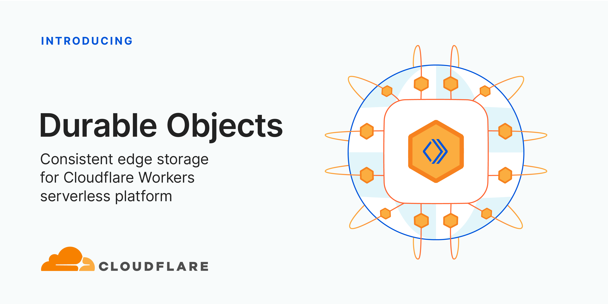

# Workers Durable Objects Beta: A New Approach to Stateful Serverless

By Kenton Varda · The Cloudflare Blog · September 28, 2020



We [launched Cloudflare Workers® in 2017](https://blog.cloudflare.com/introducing-cloudflare-workers/) with a radical vision: code running at the network edge could not only improve performance, but also be easier to deploy and cheaper to run than code running in a single datacenter. That vision means Workers is about more than just edge compute -- we're rethinking how applications are built.

Using a "serverless" approach has allowed us to make deploys dead simple, and using [isolate technology](https://blog.cloudflare.com/cloud-computing-without-containers/) has allowed us to deliver serverless more cheaply and [without the lengthy cold starts](https://blog.cloudflare.com/eliminating-cold-starts-with-cloudflare-workers/) that hold back other providers. We added easy-to-use eventually-consistent edge storage to the platform with [Workers KV](https://blog.cloudflare.com/workers-kv-is-ga/).

But up until today, it hasn't been possible to manage state with strong consistency, or to coordinate in real time between multiple clients, entirely on the edge. Thus, these parts of your application still had to be hosted elsewhere.

Durable Objects provide a truly serverless approach to storage and state: consistent, low-latency, distributed, yet effortless to maintain and scale. They also provide an easy way to coordinate between clients, whether it be users in a particular chat room, editors of a particular document, or IoT devices in a particular smart home. Durable Objects are the missing piece in the Workers stack that makes it possible for whole applications to run entirely on the edge, with no centralized "origin" server at all.

Today we are beginning a closed beta of Durable Objects.

## What is a "Durable Object"?

I'm going to be honest: naming this product was hard, because it's not quite like any other cloud technology that is widely-used today. This proverbial bike shed has many layers of paint, but ultimately we settled on "Unique Durable Objects", or "Durable Objects" for short. Let me explain what they are by breaking that down:
- **Objects:** Durable Objects are objects in the sense of Object-Oriented Programming. A Durable Object is an instance of a class -- literally, a class definition written in JavaScript (or [your language of choice](https://blog.cloudflare.com/cloudflare-workers-announces-broad-language-support/)). The class has methods which define its public interface. An object is an instance of this class, combining the code with some private state.
- **Unique:** Each object has a globally-unique identifier. That object exists in only one location in the whole world at a time. Any Worker running anywhere in the world that knows the object's ID can send messages to it. All those messages end up delivered to the same place.
- **Durable:** Unlike a normal object in JavaScript, Durable Objects can have persistent state stored on disk. Each object's durable state is private to it, which means not only that access to storage is fast, but the object can even safely maintain a consistent copy of the state in memory and operate on it with zero latency. The in-memory object will be shut down when idle and recreated later on-demand.

## What can they do?

Durable Objects have two primary abilities:
- **Storage:** Each object has attached durable storage. Because this storage is private to a specific object, the storage is always co-located with the object. This means the storage can be very fast while providing strong, transactional consistency. Durable Objects apply the serverless philosophy to storage, splitting the traditional large monolithic databases up into many small, logical units. In doing so, we get the advantages you've come to expect from serverless: effortless scaling with zero maintenance burden.
- **Coordination:** Historically, with Workers, each request would be randomly load-balanced to a Worker instance. Since there was no way to control which instance received a request, there was no way to force two clients to talk to the same Worker, and therefore no way for clients to coordinate through Workers. Durable Objects change that: requests related to the same topic can be forwarded to the same object, which can then coordinate between them, without any need to touch storage. For example, this can be used to facilitate real-time chat, collaborative editing, video conferencing, pub/sub message queues, game sessions, and much more.

The astute reader may notice that many coordination use cases call for WebSockets -- and indeed, conversely, most WebSocket use cases require coordination. Because of this complementary relationship, along with the Durable Objects beta, we've also added WebSocket support to Workers. For more on this, [see the Q&A below](https://blog.cloudflare.com/introducing-workers-durable-objects/#can-durable-objects-serve-websockets).

## Region: Earth


When using Durable Objects, Cloudflare automatically determines the Cloudflare datacenter that each object will live in, and can transparently migrate objects between locations as needed.

Traditional databases and stateful infrastructure usually require you to think about geographical "regions", so that you can be sure to store data close to where it is used. Thinking about regions can often be an unnatural burden, especially for applications that are not inherently geographical.

With Durable Objects, you instead design your storage model to match your application's logical data model. For example, a document editor would have an object for each document, while a chat app would have an object for each chat. There is no problem creating millions or billions of objects, as each object has minimal overhead.

## Killer app: Real-time collaborative document editing

Let's say you have a spreadsheet editor application -- or, really, any kind of app where users edit a complex document. It works great for one user, but now you want multiple users to be able to edit it at the same time. How do you accomplish this?

For the standard web application stack, this is a hard problem. Traditional databases simply aren't designed to be real-time. When Alice and Bob are editing the same spreadsheet, you want every one of Alice's keystrokes to appear immediately on Bob's screen, and vice versa. But if you merely store the keystrokes to a database, and have the users repeatedly poll the database for new updates, at best your application will have poor latency, and at worst you may find database transactions repeatedly fail as users on opposite sides of the world fight over editing the same content.

The secret to solving this problem is to have a live coordination point. Alice and Bob connect to the same coordinator, typically using WebSockets. The coordinator then forwards Alice's keystrokes to Bob and Bob's keystrokes to Alice, without having to go through a storage layer. When Alice and Bob edit the same content at the same time, the coordinator resolves conflicts instantly. The coordinator can then take responsibility for updating the document in storage -- but because the coordinator keeps a live copy of the document in-memory, writing back to storage can happen asynchronously.

Every big-name real-time collaborative document editor works this way. But for many web developers, especially those building on serverless infrastructure, this kind of solution has long been out-of-reach. Standard serverless infrastructure -- and even cloud infrastructure more generally -- just does not make it easy to assign these coordination points and direct users to talk to the same instance of your server.

Durable Objects make this easy. Not only do they make it easy to assign a coordination point, but Cloudflare will automatically create the coordinator close to the users using it and migrate it as needed, minimizing latency. The availability of local, durable storage means that changes to the document can be saved reliably in an instant, even if the eventual long-term storage is slower. Or, you can even store the entire document on the edge and abandon your database altogether.

With Durable Objects lowering the barrier, we hope to see real-time collaboration become the norm across the web. There's no longer any reason to make users refresh for updates.

## Example: An atomic counter

Here's a very simple example of a Durable Object which can be incremented, decremented, and read over HTTP. This counter is *consistent* even when receiving simultaneous requests from multiple clients -- none of the increments or decrements will be lost. At the same time, reads are served entirely from memory, no disk access needed.

```js
export class Counter {
  // Constructor called by the system when the object is needed to
  // handle requests.
  constructor(controller, env) {
    // `controller.storage` is an interface to access the object's
    // on-disk durable storage.
    this.storage = controller.storage
  }

  // Private helper method called from fetch(), below.
  async initialize() {
    let stored = await this.storage.get("value");
    this.value = stored || 0;
  }

  // Handle HTTP requests from clients.
  //
  // The system calls this method when an HTTP request is sent to
  // the object. Note that these requests strictly come from other
  // parts of your Worker, not from the public internet.
  async fetch(request) {
    // Make sure we're fully initialized from storage.
    if (!this.initializePromise) {
      this.initializePromise = this.initialize();
    }
    await this.initializePromise;

    // Apply requested action.
    let url = new URL(request.url);
    switch (url.pathname) {
      case "/increment":
        ++this.value;
        await this.storage.put("value", this.value);
        break;
      case "/decrement":
        --this.value;
        await this.storage.put("value", this.value);
        break;
      case "/":
        // Just serve the current value. No storage calls needed!
        break;
      default:
        return new Response("Not found", {status: 404});
    }

    // Return current value.
    return new Response(this.value);
  }
}
```

Once the class has been bound to a Durable Object namespace, a particular instance of `Counter` can be accessed from anywhere in the world using code like:

```js
// Derive the ID for the counter object named "my-counter".
// This name is associated with exactly one instance in the
// whole world.
let id = COUNTER_NAMESPACE.idFromName("my-counter");

// Send a request to it.
let response = await COUNTER_NAMESPACE.get(id).fetch(request);
```

## Demo: Chat

Chat is arguably real-time collaboration in its purest form. And to that end, we have built a demo open source chat app that runs entirely at the edge using Durable Objects.

[See the source code on GitHub »](https://github.com/cloudflare/workers-chat-demo)

This chat app uses a Durable Object to control each chat room. Users connect to the object using WebSockets. Messages from one user are broadcast to all the other users. The chat history is also stored in durable storage, but this is only for history. Real-time messages are relayed directly from one user to others without going through the storage layer.

Additionally, this demo uses Durable Objects for a second purpose: Applying a rate limit to messages from any particular IP. Each IP is assigned a Durable Object that tracks recent request frequency, so that users who send too many messages can be temporarily blocked -- even across multiple chat rooms. Interestingly, these objects don't actually store any durable state at all, because they only care about very recent history, and it's not a big deal if a rate limiter randomly resets on occasion. So, these rate limiter objects are an example of a pure coordination object with no storage.

This chat app is only a few hundred lines of code. The deployment configuration is only a few lines. Yet, it will scale seamlessly to any number of chat rooms, limited only by Cloudflare's available resources. Of course, any *individual* chat room's scalability has a limit, since each object is single-threaded. But, that limit is far beyond what a human participant could keep up with anyway.

## Other use cases

Durable Objects have infinite uses. Here are just a few ideas, beyond the ones described above:
- **Shopping cart:** An online storefront could track a user's shopping cart in an object. The rest of the storefront could be served as a fully static web site. Cloudflare will automatically host the cart object close to the end user, minimizing latency.
- **Game server:** A multiplayer game could track the state of a match in an object, hosted on the edge close to the players.
- **IoT coordination:** Devices within a family's house could coordinate through an object, avoiding the need to talk to distant servers.
- **Social feeds:** Each user could have a Durable Object that aggregates their subscriptions.
- **Comment/chat widgets:** A web site that is otherwise static content can add a comment widget or even a live chat widget on individual articles. Each article would use a separate Durable Object to coordinate. This way the origin server can focus on static content only.

## The Future: True Edge Databases

We see Durable Objects as a low-level primitive for building distributed systems. Some applications, like those mentioned above, can use objects directly to implement a coordination layer, or maybe even as their sole storage layer.

However, Durable Objects today are not a complete database solution. Each object can see only its own data. To perform a query or transaction across multiple objects, the application needs to do some extra work.

That said, every big distributed database – whether it be relational, document, graph, etc. – is, at some low level, composed of "chunks" or "shards" that store one piece of the overall data. The job of a distributed database is to coordinate between chunks.

We see a future of edge databases that store each "chunk" as a Durable Object. By doing so, it will be possible to build [databases that operate entirely at the edge](https://www.cloudflare.com/developer-platform/products/d1/), fully distributed with no regions or home location. These databases need not be built by us; anyone can potentially build them on top of Durable Objects. Durable Objects are only the first step in the edge storage journey.

## Join the Beta

Storing data is a big responsibility which we do not take lightly. Because of the critical importance of getting it right, we are being careful. We will be making Durable Objects available gradually over the next several months.

As with any beta, this product is a work in progress, and some of what is described in this post is not fully enabled yet. Full details of beta limitations can be found in [the documentation](https://developers.cloudflare.com/workers/learning/using-durable-objects).

If you'd like to try out Durable Objects now, tell us about your use case. We'll be selecting the most interesting use cases for early access.

## Q&A

### Can Durable Objects serve WebSockets?

Yes.

As part of the Durable Objects beta, we've made it possible for Workers to act as WebSocket endpoints -- including as a client or as a server. Before now, Workers could proxy WebSocket connections on to a back-end server, but could not speak the protocol directly.

While technically any Worker can speak WebSocket in this way, WebSockets are most useful when combined with Durable Objects. When a client connects to your application using a WebSocket, you need a way for server-generated events to be sent back to the existing socket connection. Without Durable Objects, there's no way to send an event to the specific Worker holding a WebSocket. With Durable Objects, you can now forward the WebSocket to an Object. Messages can then be addressed to that Object by its unique ID, and the Object can then forward those messages down the WebSocket to the client.

The chat app demo presented above uses WebSockets. [Check out the source code](https://github.com/cloudflare/workers-chat-demo) to see how it works.

### How does this compare to Workers KV?

Two years ago, we introduced Workers KV, a global key-value data store. KV is a fairly minimalist global data store that serves certain purposes well, but is not for everyone. KV is **eventually consistent**, which means that writes made in one location may not be visible in other locations immediately. Moreover, it implements "last write wins" semantics, which means that if a single key is being modified from multiple locations in the world at once, it's easy for those writes to overwrite each other. KV is designed this way to support low-latency reads for data that doesn't frequently change. However, these design decisions make KV inappropriate for state that changes frequently, or when changes need to be immediately visible worldwide.

Durable Objects, in contrast, are not primarily a storage product at all -- many use cases for them do not actually utilize durable storage. To the extent that they do provide storage, Durable Objects sit at the opposite end of the storage spectrum from KV. They are extremely well-suited to workloads requiring transactional guarantees and immediate consistency. However, since transactions inherently must be coordinated in a single location, and clients on the opposite side of the world from that location will experience moderate latency due to the inherent limitations of the speed of light. Durable Objects will combat this problem by auto-migrating to live close to where they are used.

In short, Workers KV remains the best way to serve static content, configuration, and other rarely-changing data around the world, while Durable Objects are better for managing dynamic state and coordination.

Going forward, we plan to utilize Durable Objects in the implementation of Workers KV itself, in order to deliver even better performance.

### Why not use CRDTs?

You can build CRDT-based storage on top of Durable Objects, but Durable Objects do not require you to use CRDTs.

Conflict-free Replicated Data Types (CRDTs), or their cousins, Operational Transforms (OTs), are a technology that allows data to be edited from multiple places in the world simultaneously without synchronization, and without data loss. For example, these technologies are commonly used in the implementation of real-time collaborative document editors, so that a user's keypresses can show up in their local copy of the document in real time, without waiting to see if anyone else edited another part of the document first. Without getting into details, you can think of these techniques like a real time version of "git fork" and "git merge", where all merge conflicts are resolved automatically in a deterministic way, so that everyone ends up with the same state in the end.

CRDTs are a powerful technology, but applying them correctly can be challenging. Only certain kinds of data structures lend themselves to automatic conflict resolution in a way that doesn't lead to easy data loss. Any developer familiar with git can see the problem: arbitrary conflict resolution is hard, and any automated algorithm for it will likely get things wrong sometimes. It's all the more difficult if the algorithm has to handle merges in arbitrary order and still get the same answer.

We feel that, for most applications, CRDTs are overly complex and not worth the effort. Worse, the set of data structures that can be represented as a CRDT is too limited for many applications. It's usually much easier to assign a single authoritative coordination point for each document, which is exactly what Durable Objects accomplish.

With that said, CRDTs can be used on top of Durable Objects. If an object's state lends itself to CRDT treatment, then an application could replicate that object into several objects serving different regions, which then synchronize their states via CRDT. This would make sense for applications to implement as an optimization if and when they find it is worth the effort.

## Last thoughts: What does it mean for state to be "serverless"?

Traditionally, serverless has focused on stateless compute. In serverless architectures, the logical unit of compute is reduced to something fine-grained: a single event, such as an HTTP request. This works especially well because *events* just happened to be the logical unit of work that we think about when designing server applications. No one thinks about their business logic in units of "servers" or "containers" or "processes" -- we think about *events*. It is exactly because of this semantic alignment that serverless succeeds in shifting so much of the logistical burden of maintaining servers away from the developer and towards the cloud provider.

However, [serverless architecture](https://www.cloudflare.com/learning/serverless/what-is-serverless/) has traditionally been stateless. Each event executes in isolation. If you wanted to store data, you had to connect to a traditional database. If you wanted to coordinate between requests, you had to connect to some other service that provides that ability. These external services have tended to re-introduce the operational concerns that serverless was intended to avoid. Developers and service operators have to worry not just about scaling their databases to handle increasing load, but also about how to split their database into "regions" to effectively handle global traffic. The latter concern can be especially cumbersome.

So how can we apply the serverless philosophy to state? Just like serverless compute is about splitting compute into fine-grained pieces, serverless state is about splitting state into fine-grained pieces. Again, we seek to find a unit of state that corresponds to logical units in our application. The logical unit of state in an application is not a "table" or a "collection" or a "graph". Instead, it depends on the application. The logical unit of state in a chat app is a chat room. The logical unit of state in an online spreadsheet editor is a spreadsheet. The logical unit of state in an online storefront is a shopping cart. By making the *physical* unit of storage provided by the storage layer match the *logical* unit of state inherent in the application, we can allow the underlying storage provider (Cloudflare) to take responsibility for a wide array of logistical concerns that previously fell on the developer, including scalability and regionality.

This is what Durable Objects do.
